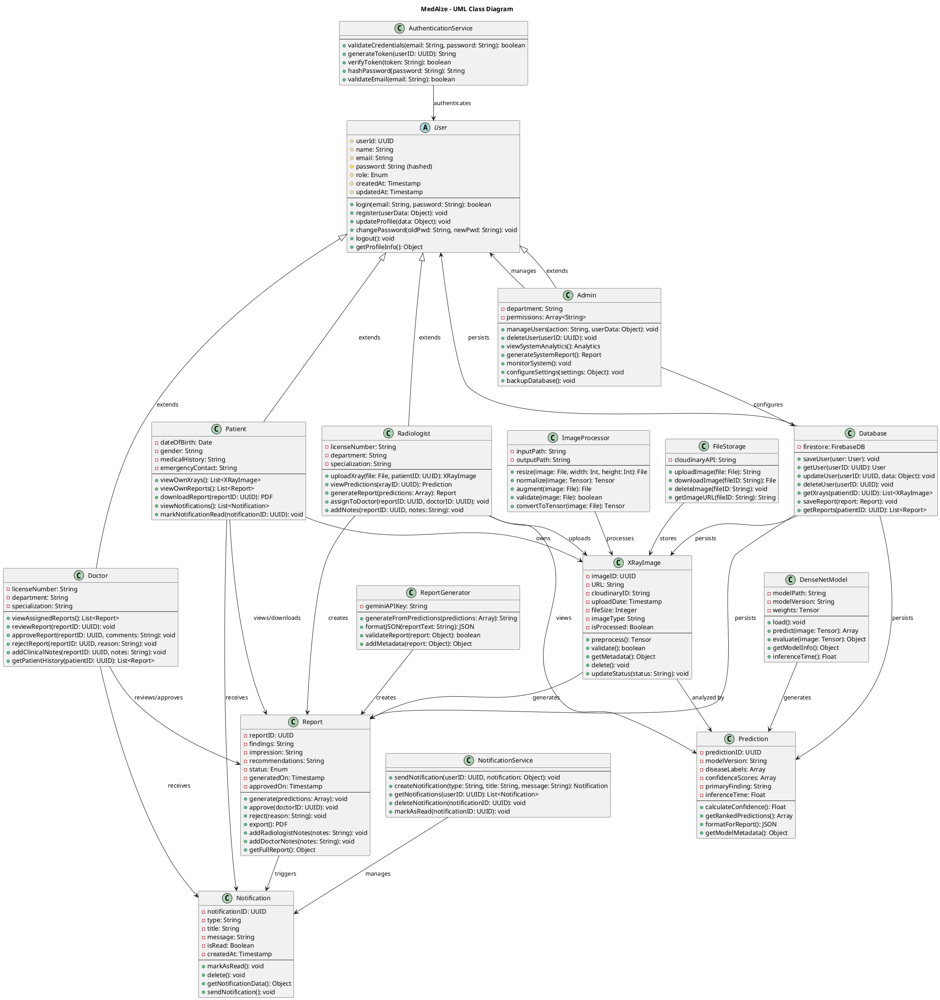
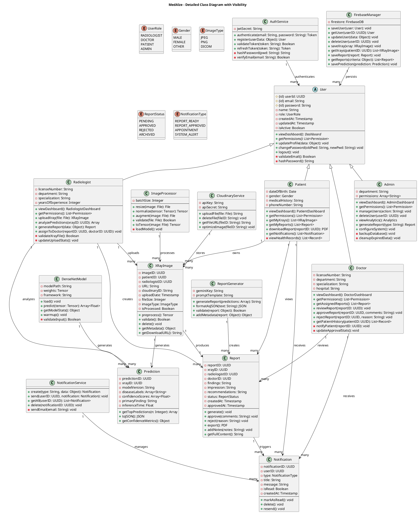
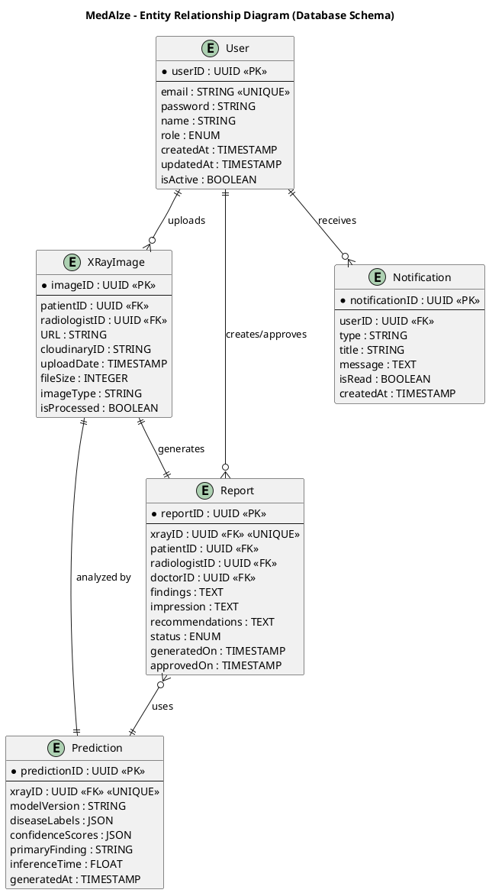

# MedAlze UML Class Diagram & ERD - Complete Set

## 1. Class Diagram - PlantUML (Software Architecture)



---

## 2. Class Diagram - Detailed Version (Alternative)



---

## 3. Entity-Relationship Diagram (ERD) - Database Schema



---

## 4. Comparison Table

```
┌──────────────────────────────────────────────────────────────────────┐
│            CLASS DIAGRAM vs ERD - Side by Side                       │
├──────────────────────────────────────────────────────────────────────┤
│ ASPECT              │ CLASS DIAGRAM      │ ERD                       │
├──────────────────────────────────────────────────────────────────────┤
│ Purpose             │ Software design   │ Database design           │
│ Shows               │ Classes & methods │ Entities & attributes     │
│ Focuses on          │ Object behavior   │ Data structure            │
│ Audience            │ Developers        │ Database architects       │
│ Methods?            │ ✅ YES            │ ❌ NO                     │
│ Inheritance?        │ ✅ YES            │ ❌ NO (abstract)          │
│ Polymorphism?       │ ✅ YES            │ ❌ NO                     │
│ Primary Key         │ Not highlighted   │ ✅ Marked with *          │
│ Foreign Key         │ Not shown         │ ✅ Marked with FK         │
│ Data types          │ In class diagram  │ ✅ SQL types specified    │
│ Relationships       │ Inheritance,      │ 1:1, 1:M, M:M             │
│                     │ composition       │                           │
│ Example             │ +login()          │ email: VARCHAR(255)       │
│ Focus               │ "What can it do?" │ "What data is stored?"    │
├──────────────────────────────────────────────────────────────────────┤
│ FOR MedAlze:                                                         │
│ Class Diagram shows:                                                 │
│ - Radiologist.uploadXray() method                                    │
│ - Doctor.approveReport() behavior                                    │
│ - Inheritance from User class                                        │
│                                                                      │
│ ERD shows:                                                           │
│ - User table with fields (userID, email, password, role)            │
│ - XRayImage table linked to User                                    │
│ - One-to-many relationship: User uploads many XRayImages            │
└──────────────────────────────────────────────────────────────────────┘
```

---

## 5. How They Work Together

```
DEVELOPMENT PROCESS:

Step 1: CLASS DIAGRAM (Design Phase)
   └─ Define User, Radiologist, Doctor, Patient classes
   └─ Define methods: uploadXray(), generateReport()
   └─ Show inheritance and relationships
   └─ Used by: Software architects & developers

            ↓ USED FOR CODING ↓

Step 2: IMPLEMENT CLASSES
   └─ Write Python/TypeScript classes
   └─ Implement methods
   └─ Create object structure

            ↓ NEED TO PERSIST DATA ↓

Step 3: ERD (Database Design Phase)
   └─ Design User entity with fields
   └─ Design XRayImage entity
   └─ Define primary/foreign keys
   └─ Show cardinality (1:1, 1:M)
   └─ Used by: Database architects & DBAs

            ↓ USED FOR DATABASE ↓

Step 4: CREATE DATABASE
   └─ Create tables from ERD
   └─ Set up indexes and constraints
   └─ Create relationships
   └─ Deploy to Firebase/SQL
```

---

## 6. PlantUML Online Links

**For Class Diagram #1:**
- Go to: https://www.plantuml.com/plantuml/uml/
- Copy Section 1 code
- Paste & click "Update"

**For ERD:**
- Go to: https://www.plantuml.com/plantuml/uml/
- Copy Section 3 code
- Paste & click "Update"

---

## 7. Quick Summary

### **Use CLASS DIAGRAM When:**
- ✅ Designing software architecture
- ✅ Showing object-oriented structure
- ✅ Planning inheritance hierarchies
- ✅ Documenting methods & behaviors
- ✅ Creating API design

### **Use ERD When:**
- ✅ Designing database schema
- ✅ Planning data storage
- ✅ Showing data relationships
- ✅ Defining table constraints
- ✅ Data modeling

### **For Your Thesis:**
- **Chapter 3 (System Design)** → Include Class Diagram
- **Chapter 4 (Implementation)** → Include ERD

**Both are essential for complete software documentation!** 📊
