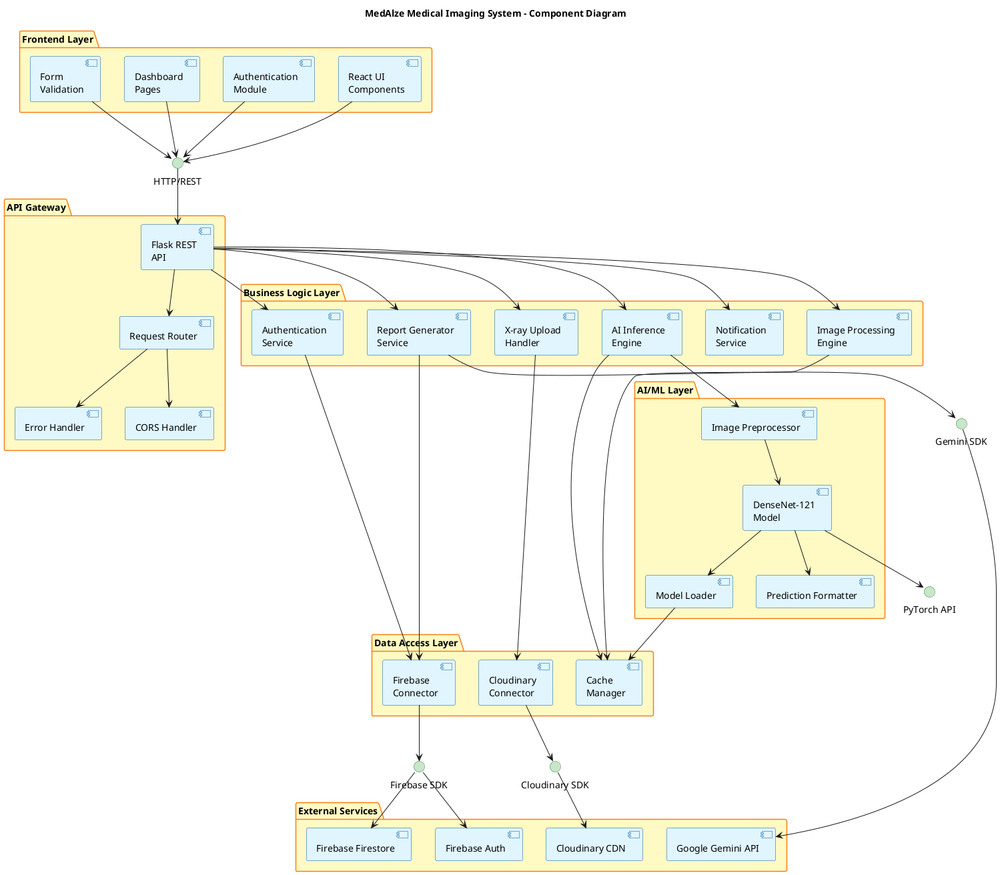
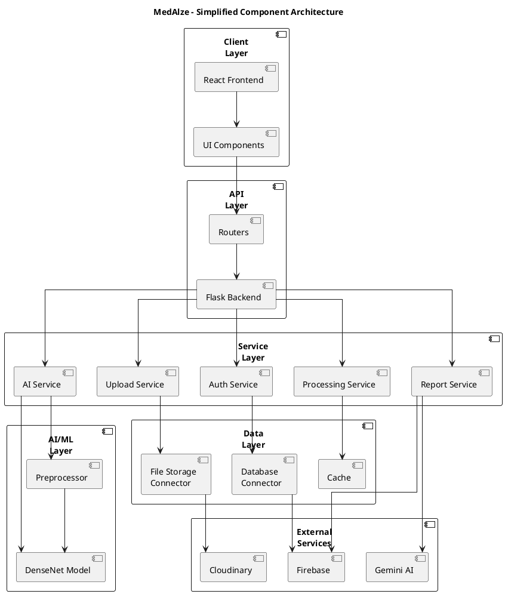
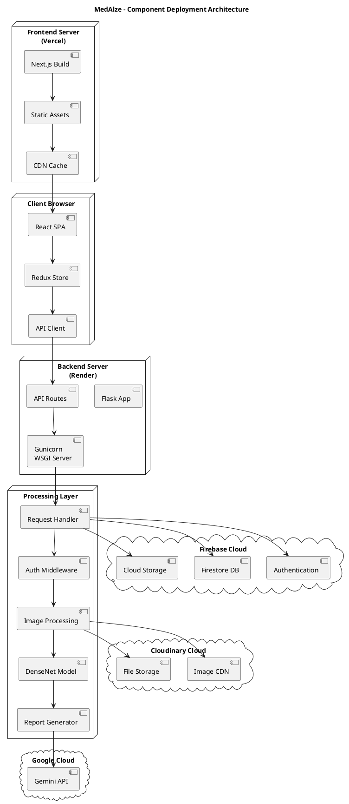
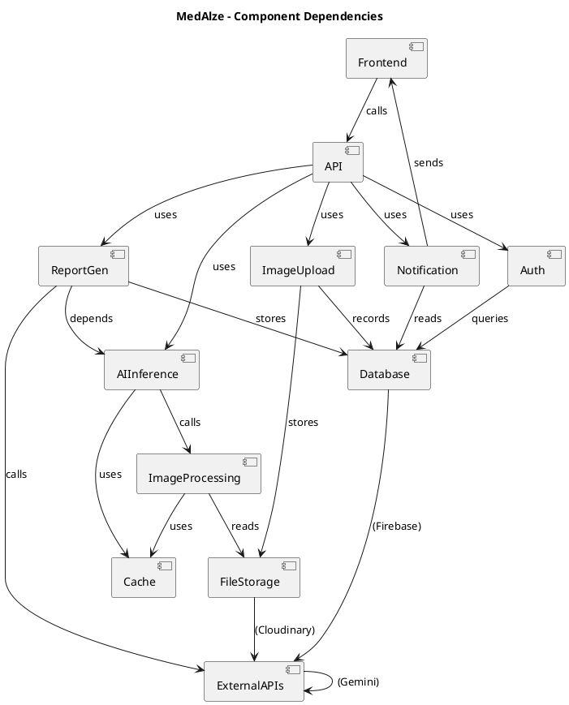

# MedAlze Component Diagram

## 1. Component Diagram - PlantUML (Recommended for Thesis)



---

## 2. Simplified Component Diagram (Alternative)



---

## 3. Detailed Component with Interfaces (Most Professional)

```plantuml
@startuml MedAlze_Component_Professional
title MedAlze System - Component Diagram with Interfaces

' Define interfaces first
interface IAuthentication as IAuth << interface >>
interface IImageUpload as IUpload << interface >>
interface IImageProcessing as IProcess << interface >>
interface IAIPrediction as IAI << interface >>
interface IReportGeneration as IReport << interface >>
interface IDataAccess as IData << interface >>
interface INotification as INotif << interface >>
interface IExternalServices as IExternal << interface >>

' Frontend Components
component [React Application] as ReactApp implements IAuth, IUpload, IProcess, IAI, IReport, INotif

' API Layer Components
component [Flask REST API] as FlaskAPI implements IAuth, IUpload, IProcess, IAI, IReport, IData, INotif

' Service Components
component [Authentication Service] as AuthService implements IAuth
component [Upload Handler] as UploadHandler implements IUpload
component [Image Processor] as ImageProc implements IProcess
component [DenseNet Inference] as DenseNetInf implements IAI
component [Report Generator] as ReportGenerator implements IReport
component [Notification Engine] as NotifEngine implements INotif

' Data Access Components
component [Firebase Manager] as FirebaseManager implements IData
component [Cloudinary Manager] as CloudinaryManager implements IData
component [Model Cache] as ModelCache implements IData

' External Services Components
component [Firebase Services] as FirebaseExt implements IExternal
component [Cloudinary API] as CloudinaryAPI implements IExternal
component [Google Gemini API] as GeminiAPI implements IExternal

' AI/ML Components
component [DenseNet-121 Model] as DenseNetModel
component [Image Preprocessor] as ImgPreproc
component [PyTorch Runtime] as PyTorchRT

' Relationships
ReactApp --> FlaskAPI: uses

FlaskAPI --> AuthService: delegates
FlaskAPI --> UploadHandler: delegates
FlaskAPI --> ImageProc: delegates
FlaskAPI --> DenseNetInf: delegates
FlaskAPI --> ReportGenerator: delegates
FlaskAPI --> NotifEngine: delegates

AuthService --> FirebaseManager: uses
UploadHandler --> CloudinaryManager: uses
ImageProc --> ModelCache: uses
DenseNetInf --> ModelCache: uses
DenseNetInf --> ImgPreproc: uses
DenseNetInf --> DenseNetModel: uses
ReportGenerator --> FirebaseManager: uses

FirebaseManager --> FirebaseExt: connects
CloudinaryManager --> CloudinaryAPI: connects
ReportGenerator --> GeminiAPI: connects

ImgPreproc --> PyTorchRT: uses
DenseNetModel --> PyTorchRT: uses

@enduml
```

---

## 4. Component Diagram - Deployment View



---

## 5. Component Dependencies Graph



---

## 6. Text-Based Component Overview

```
┌─────────────────────────────────────────────────────────────────┐
│                    MedAlze Component Architecture               │
└─────────────────────────────────────────────────────────────────┘

┌─────────────────────────────────────────────────────────────────┐
│                      FRONTEND LAYER (Vercel)                    │
├─────────────────────────────────────────────────────────────────┤
│  • React Application                                             │
│  • TypeScript Components                                         │
│  • Redux State Management                                        │
│  • Tailwind CSS Styling                                          │
│  • Form Validation                                               │
└─────────────────────────────────────────────────────────────────┘
                              ↓ HTTP/REST
┌─────────────────────────────────────────────────────────────────┐
│                  API GATEWAY LAYER (Flask/Render)               │
├─────────────────────────────────────────────────────────────────┤
│  • Flask REST API Server                                         │
│  • Gunicorn WSGI Server                                          │
│  • Request Router                                                │
│  • Middleware (Auth, CORS, Logging)                              │
│  • Error Handler                                                 │
└─────────────────────────────────────────────────────────────────┘
           ↓ ↓ ↓ ↓ ↓ ↓ ↓
┌──────────────────────────────────────────────────────────────┐
│              BUSINESS LOGIC LAYER                            │
├──────────────────────────────────────────────────────────────┤
│ ┌─────────────────┐  ┌─────────────────┐                    │
│ │Auth Service     │  │Upload Handler   │                    │
│ │- Login/Register │  │- File Validation│                    │
│ │- JWT Tokens     │  │- Size Check     │                    │
│ │- Verify User    │  │- Format Check   │                    │
│ └─────────────────┘  └─────────────────┘                    │
│ ┌─────────────────┐  ┌─────────────────┐                    │
│ │Image Processor  │  │AI Engine        │                    │
│ │- Resize 224x224 │  │- DenseNet Model │                    │
│ │- Normalize      │  │- Forward Pass   │                    │
│ │- Convert Tensor │  │- 14 Predictions │                    │
│ └─────────────────┘  └─────────────────┘                    │
│ ┌─────────────────┐  ┌─────────────────┐                    │
│ │Report Generator │  │Notification Svc │                    │
│ │- Gemini Prompt  │  │- Send Alerts    │                    │
│ │- JSON Format    │  │- Track Status   │                    │
│ │- Validation     │  │- Email/SMS      │                    │
│ └─────────────────┘  └─────────────────┘                    │
└──────────────────────────────────────────────────────────────┘
           ↓ ↓ ↓ ↓ ↓ ↓ ↓
┌──────────────────────────────────────────────────────────────┐
│              DATA ACCESS LAYER                               │
├──────────────────────────────────────────────────────────────┤
│ • Firebase Connector (Firestore)                             │
│ • Cloudinary Connector (Image CDN)                           │
│ • Model Cache Manager                                        │
│ • Database Connection Pool                                   │
└──────────────────────────────────────────────────────────────┘
        ↓           ↓            ↓
┌──────────────┐ ┌──────────┐ ┌──────────────┐
│   Firebase   │ │Cloudinary│ │Google Gemini │
│   Firestore  │ │   CDN    │ │    API       │
└──────────────┘ └──────────┘ └──────────────┘

┌──────────────────────────────────────────────────────────────┐
│              AI/ML LAYER                                     │
├──────────────────────────────────────────────────────────────┤
│ • DenseNet-121 Model (27 MB)                                 │
│ • Image Preprocessor                                         │
│ • Model Loader (lazy-loaded)                                 │
│ • PyTorch Runtime                                            │
│ • GPU/CPU Support                                            │
└──────────────────────────────────────────────────────────────┘
```

---

## 7. Component Interaction Matrix

| Component | Depends On | Used By | Purpose |
|-----------|-----------|---------|---------|
| **Frontend** | API, Redux | Browser | User Interface |
| **API Gateway** | Services, DB | Frontend | Request Router |
| **Auth Service** | Firebase, DB | API | Authentication |
| **Upload Handler** | Cloudinary, DB | API | File Management |
| **Image Processor** | Cache, PyTorch | AI Engine | Preprocessing |
| **AI Engine** | DenseNet Model | Report Gen | Inference |
| **Report Generator** | Gemini API, DB | Notification | Report Creation |
| **Notification** | DB, Frontend | API | Alerts |
| **Firebase Manager** | Firestore | All Services | Data Storage |
| **Cloudinary Manager** | Cloudinary API | Upload/Process | File Storage |
| **Model Cache** | PyTorch | AI Engine | Model Management |
| **DenseNet Model** | PyTorch | AI Engine | ML Inference |

---

## How to Use in Your Thesis

### **Best Option for Thesis: #1 (Component Diagram - PlantUML)**
- ✅ Shows all components organized by layers
- ✅ Shows interfaces and connections
- ✅ Professional appearance
- ✅ Easy to export as PNG/SVG

### **Online PlantUML Editor:**
1. Go to: https://www.plantuml.com/plantuml/uml/
2. Copy code from Section 1, 2, or 3
3. Paste and click "Update"
4. Export as PNG/SVG/PDF

### **In VS Code:**
```bash
# Install PlantUML extension
# Create file: component.puml
# Paste code and right-click → Preview
```

---

**Use Component Diagram #1 for your thesis - it's the most comprehensive!** 📊
