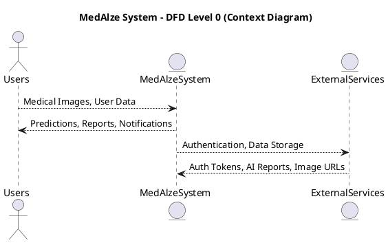
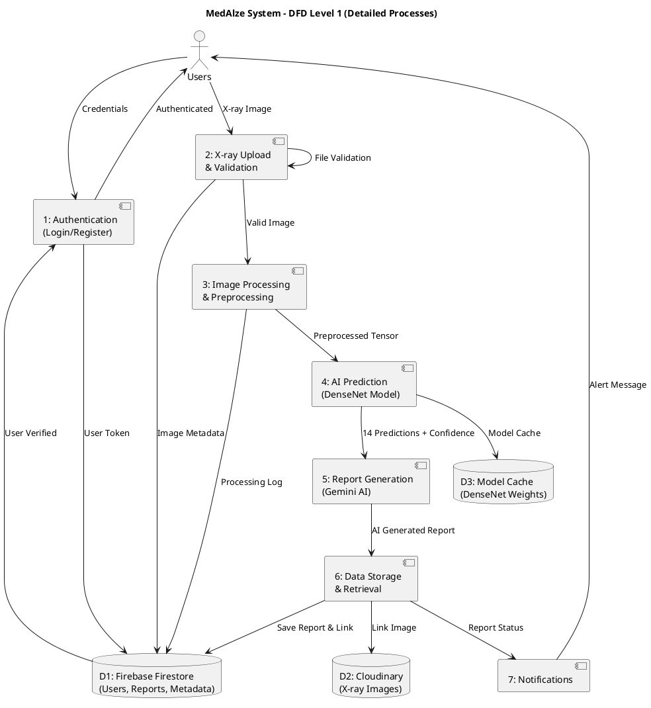
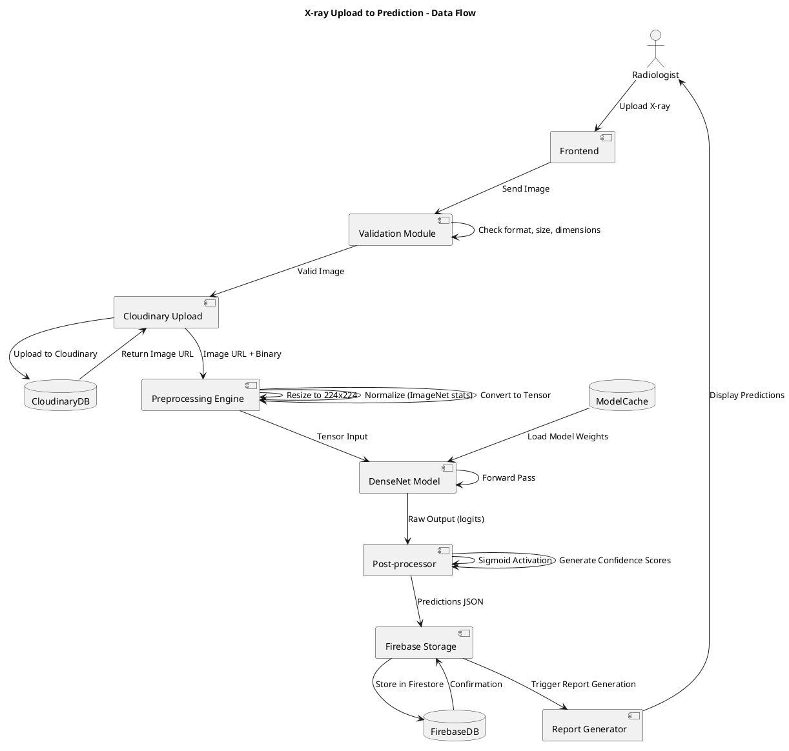
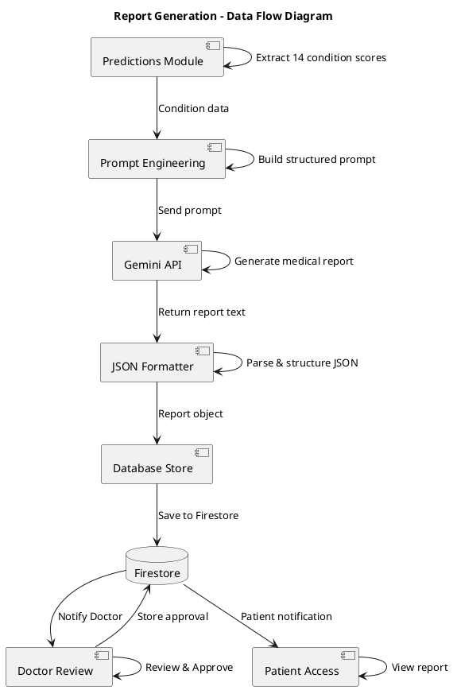
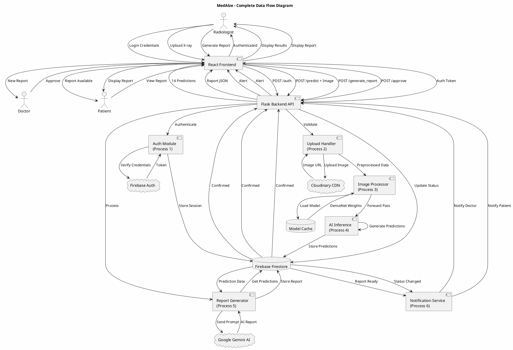
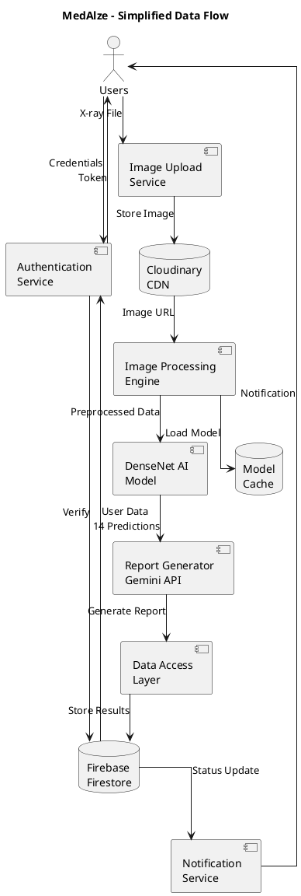

# MedAlze DFD - PlantUML Code

## Level 0 - Context Diagram (PlantUML)



---

## Level 1 - Detailed Process Flows (PlantUML)



---

## Level 1 - Alternative Syntax (Better for PlantUML Editor)

```plantuml
@startuml MedAlze_DFD_L1_Alternative
title MedAlze - DFD Level 1 (Detailed)

' Define styles
skinparam backgroundColor #FEFEFE
skinparam sequenceStyle plain

' Actors
actor Users
actor Admin

' Processes
circle P1 [Authentication\n(Process 1)]
circle P2 [X-ray Upload\n(Process 2)]
circle P3 [Image Processing\n(Process 3)]
circle P4 [AI Prediction\n(Process 4)]
circle P5 [Report Generation\n(Process 5)]
circle P6 [Data Storage\n(Process 6)]
circle P7 [Notifications\n(Process 7)]

' Data Stores
file D1 {
  folder "Firebase Firestore" {
    file Users_Data
    file Reports_Data
    file Metadata
  }
}

file D2 {
  folder "Cloudinary" {
    file XRay_Images
  }
}

file D3 {
  folder "Model Cache" {
    file DenseNet_Weights
  }
}

' Flows
Users --> P1: Credentials
P1 --> D1: Store User Token
D1 --> P1: Return Token
P1 --> Users: Auth Success

Users --> P2: Upload X-ray
P2 --> P3: Validated Image
P3 --> P4: Preprocessed Tensor
P4 --> P5: 14 Predictions
P5 --> P6: Generated Report
P6 --> D1: Store Report
P7 --> Users: Notification

D3 --> P4: Model Weights
P2 --> D2: Store Image URL
P6 --> D2: Link Image

@enduml
```

---

## Complete X-ray Processing Pipeline (PlantUML)



---

## Report Generation Data Flow (PlantUML)



---

## Full System Integration (PlantUML)



---

## Simplified DFD for Presentation (PlantUML)



---

## How to Use in PlantUML Editor

### Online PlantUML Editor:
1. Go to: https://www.plantuml.com/plantuml/uml/
2. Copy-paste any code block above
3. Click "Update"
4. Export as PNG/SVG

### In VS Code:
1. Install "PlantUML" extension
2. Create file: `dfd.puml`
3. Paste code
4. Right-click → "Preview"

### Generate Different Formats:

```bash
# PNG
plantuml dfd.puml -tpng

# SVG
plantuml dfd.puml -tsvg

# PDF
plantuml dfd.puml -tpdf
```

---

## Best DFD for Thesis: Use "Full System Integration"

This one shows:
- ✅ All actors (Radiologist, Doctor, Patient)
- ✅ All processes (Auth, Upload, Processing, AI, Report, Notify)
- ✅ All data stores (Firebase, Cloudinary, Model Cache)
- ✅ Complete data flows
- ✅ External services integration

**Perfect for including in your thesis documentation!** 📊
