# MedAlze Use Case Diagrams - Draw.io Compatible Mermaid

## 1. Main Use Case Diagram (Draw.io Compatible)

```mermaid
graph TB
    Radiologist["Radiologist"]
    Doctor["Doctor"]
    Patient["Patient"]
    Admin["Admin"]
    
    UploadXray["Upload X-ray"]
    ViewPrediction["View AI Prediction"]
    GenerateReport["Generate Report"]
    AssignDoctor["Assign Doctor"]
    
    ViewXrays["View Patient X-rays"]
    ReviewPredictions["Review Predictions"]
    ApproveReport["Approve/Comment Report"]
    
    Register["Register/Login"]
    ViewHistory["View X-ray History"]
    ReceiveNotif["Receive Notifications"]
    DownloadReports["Download Reports"]
    
    ManageUsers["Manage Users"]
    MonitorReports["Monitor Reports"]
    ViewAnalytics["View Analytics"]
    
    Radiologist --> UploadXray
    Radiologist --> ViewPrediction
    Radiologist --> GenerateReport
    Radiologist --> AssignDoctor
    
    Doctor --> ViewXrays
    Doctor --> ReviewPredictions
    Doctor --> ApproveReport
    
    Patient --> Register
    Patient --> ViewHistory
    Patient --> ReceiveNotif
    Patient --> DownloadReports
    
    Admin --> ManageUsers
    Admin --> MonitorReports
    Admin --> ViewAnalytics
```

---

## 2. Radiologist Workflow (Simplified)

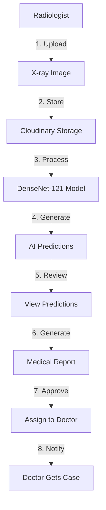

---

## 3. Doctor Workflow (Simplified)

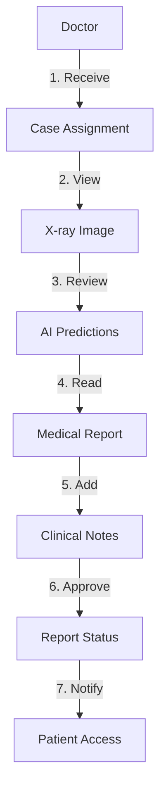

---

## 4. Patient Workflow (Simplified)

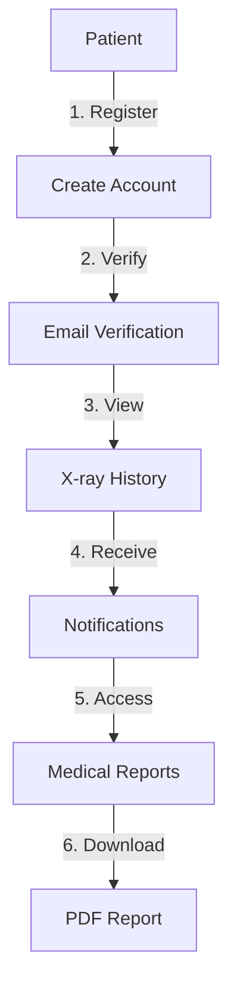

---

## 5. Admin Workflow (Simplified)

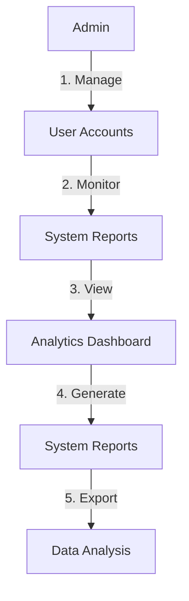

---

## 6. Complete System Architecture

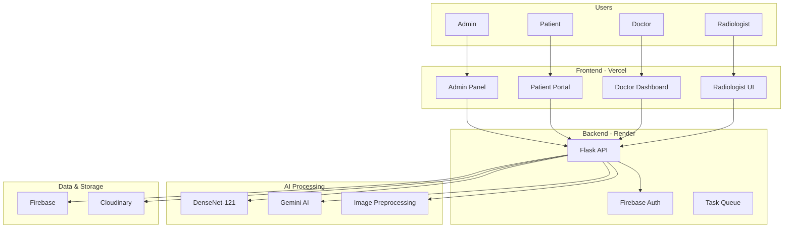

---

## 7. X-ray Processing Flow

```mermaid
graph LR
    A["Upload"] --> B["Store in Cloud"]
    B --> C["Preprocess Image"]
    C --> D["Run AI Model"]
    D --> E["Get Predictions"]
    E --> F["Display Results"]
    F --> G["Generate Report"]
    G --> H["Assign Doctor"]
    H --> I["Doctor Reviews"]
    I --> J["Doctor Approves"]
    J --> K["Patient Access"]
    K --> L["Download PDF"]
```

---

## 8. Use Case - Upload X-ray

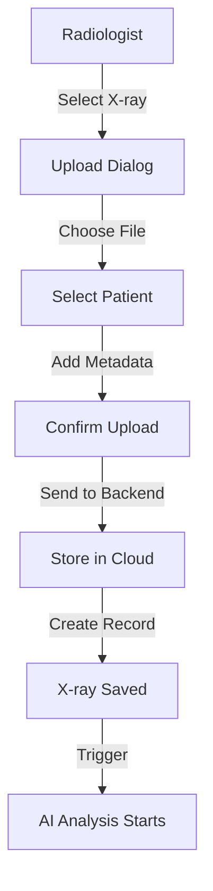

---

## 9. Use Case - Generate Report

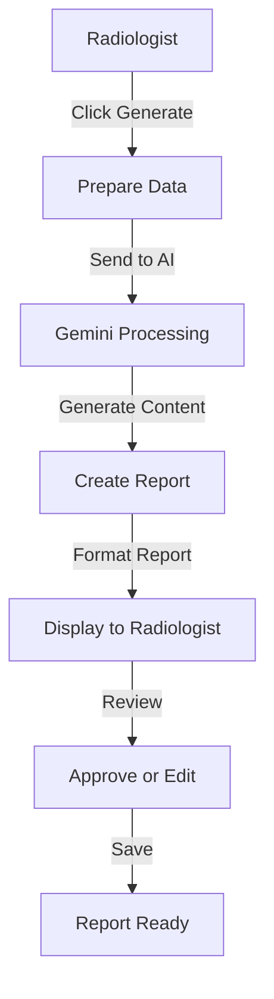

---

## 10. Use Case - Approve Report

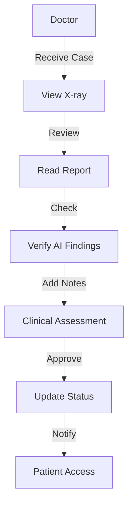

---

## 11. Authentication Flow

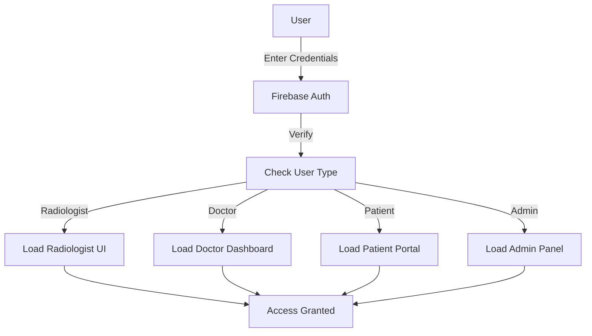

---

## 12. Report Status Workflow

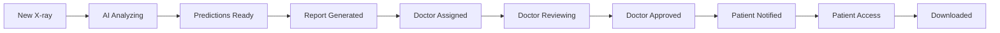

---

## 13. System Integration Points

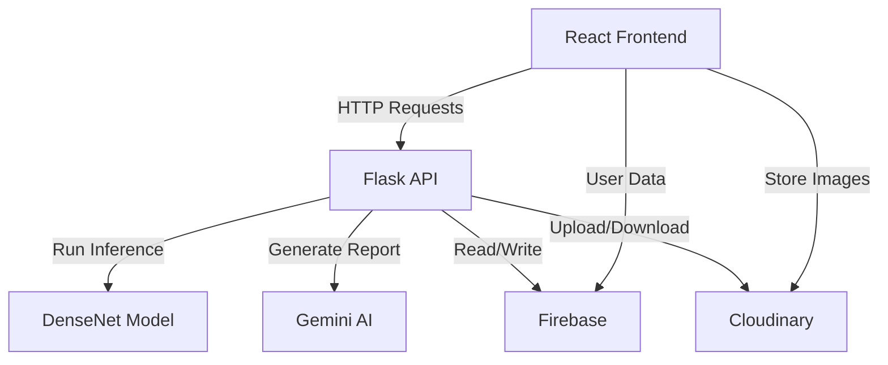

---

## 14. Role-Based Access Control

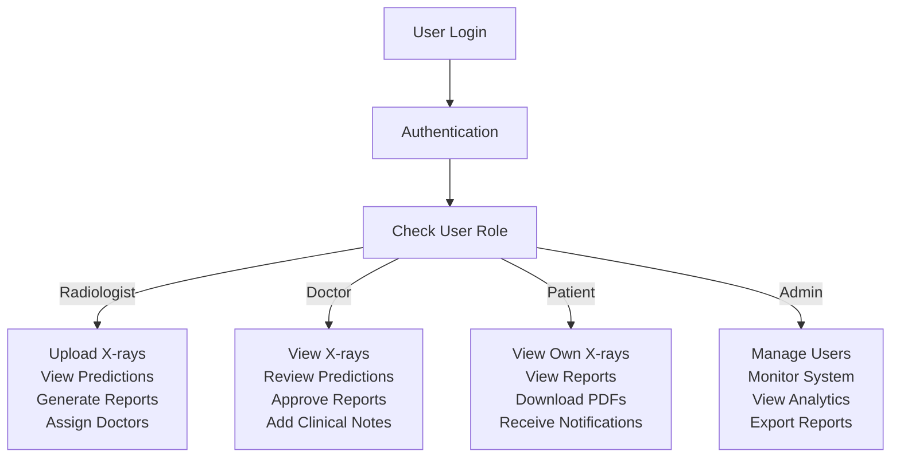

---

## 15. Error Handling Flow

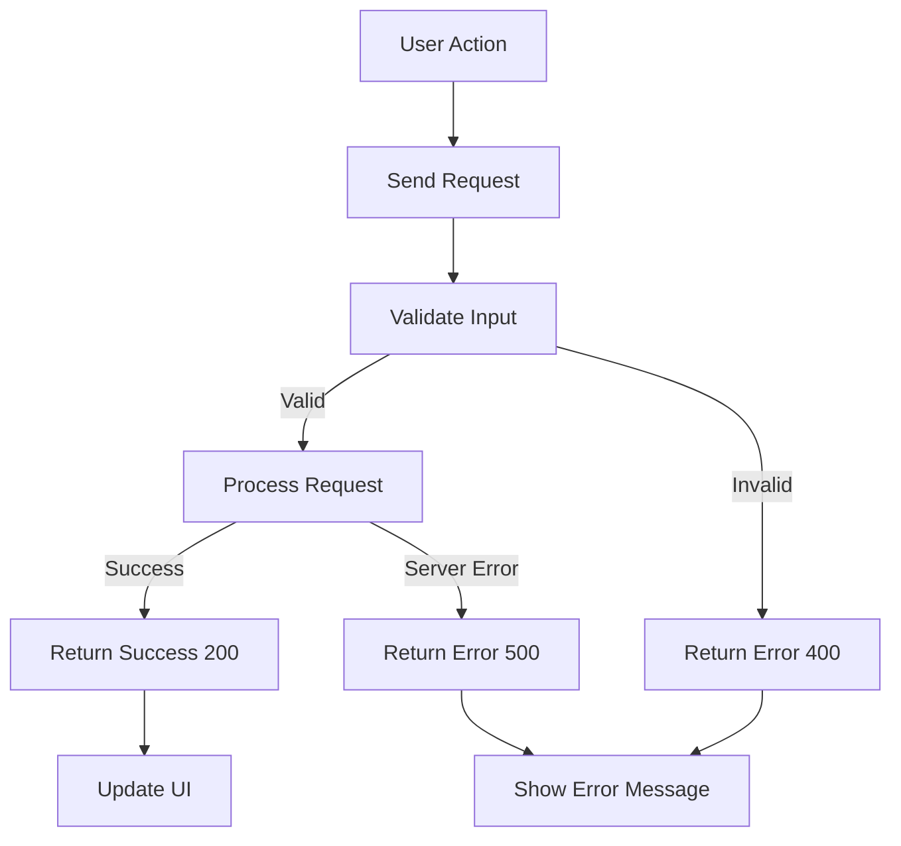

---

## How to Use in Draw.io

### Method 1: Import from Mermaid
1. Open draw.io
2. Go to **File → Import from → URL**
3. Use: `https://mermaid.live/` and paste code
4. Or manually recreate from description

### Method 2: Direct Paste
1. Create new diagram in draw.io
2. Paste these flowchart codes directly
3. draw.io will attempt to interpret

### Method 3: Use as Reference
If draw.io doesn't auto-render:
- Use the flowchart as a guide
- Manually create boxes and connections
- Follow the arrow directions shown

### Better Alternative for Draw.io:
These simplified flowchart formats work better in draw.io since it has native support for:
- **Graph (TB, TD, LR)** - flowchart direction
- **Boxes and arrows** - standard shapes
- **Subgraphs** - grouping related items

---

## Summary

All 15 diagrams use **draw.io compatible syntax**:
- ✅ No complex markdown features
- ✅ Simple graph TB/TD/LR syntax
- ✅ Basic shapes and connections
- ✅ Clean flowchart format
- ✅ Easy to understand hierarchy

**Choose the diagram that fits your documentation best!** 🎯
