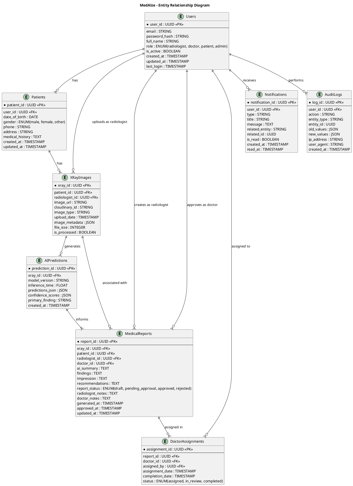
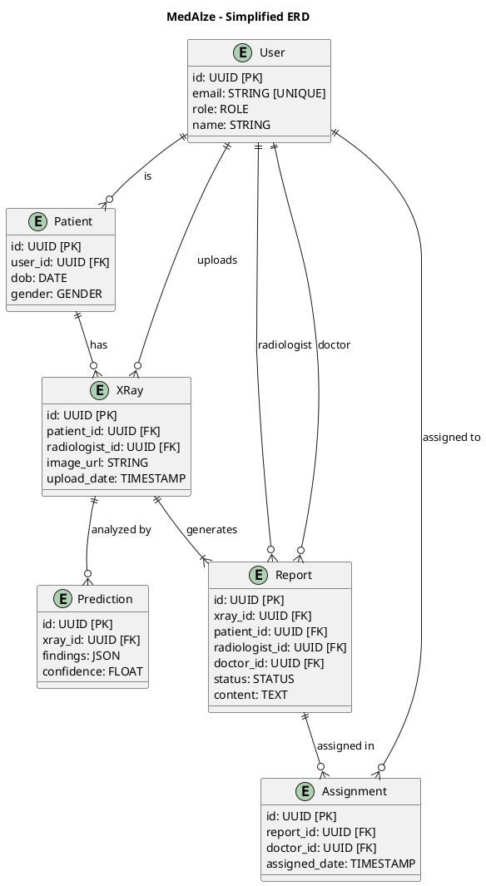
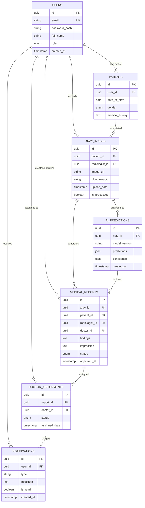

# MedAlze Entity Relationship Diagrams (ERD)

## 1. Main Database Schema - PlantUML ERD



---

## 2. Simplified ERD - Core Entities



---

## 3. Data Flow ERD

```plantuml
@startuml MedAlze_DataFlow_ERD
title MedAlze - Data Flow Through Entities

database "MedAlze DB" {
  entity Users {
    id, email, role, name
  }
  
  entity Patients {
    id, user_id, dob, gender
  }
  
  entity XRayImages {
    id, patient_id, radiologist_id
    image_url, upload_date
  }
  
  entity AIPredictions {
    id, xray_id
    findings, confidence
  }
  
  entity MedicalReports {
    id, xray_id, patient_id
    radiologist_id, doctor_id
    status, content
  }
}

cloud "External Services" {
  component Cloudinary as "Image Storage"
  component Gemini as "AI Report Gen"
  component Firebase as "Auth/DB"
}

Users --> Patients : "creates patient profile"
Users --> XRayImages : "uploads X-ray"
Patients --> XRayImages : "associated with"
XRayImages --> Cloudinary : "stores image"
XRayImages --> AIPredictions : "analyzes"
AIPredictions --> Gemini : "generates report"
Gemini --> MedicalReports : "creates"
MedicalReports --> Users : "assigned to doctor"

Users -.->|Firebase Auth| Firebase
Patients -.->|Firestore| Firebase
XRayImages -.->|Metadata| Firebase

@enduml
```

---

## 4. Complete Database Schema (SQL-Style)

```
TABLE users (
  ├─ id: UUID PRIMARY KEY
  ├─ email: VARCHAR(255) UNIQUE NOT NULL
  ├─ password_hash: VARCHAR(255) NOT NULL
  ├─ full_name: VARCHAR(255) NOT NULL
  ├─ phone: VARCHAR(20)
  ├─ role: ENUM('radiologist', 'doctor', 'patient', 'admin') NOT NULL
  ├─ is_active: BOOLEAN DEFAULT true
  ├─ email_verified: BOOLEAN DEFAULT false
  ├─ last_login: TIMESTAMP
  ├─ created_at: TIMESTAMP DEFAULT CURRENT_TIMESTAMP
  └─ updated_at: TIMESTAMP DEFAULT CURRENT_TIMESTAMP

TABLE patients (
  ├─ id: UUID PRIMARY KEY
  ├─ user_id: UUID FOREIGN KEY → users.id
  ├─ date_of_birth: DATE NOT NULL
  ├─ gender: ENUM('male', 'female', 'other')
  ├─ blood_type: VARCHAR(10)
  ├─ allergies: TEXT
  ├─ medical_history: TEXT
  ├─ emergency_contact: VARCHAR(255)
  ├─ emergency_phone: VARCHAR(20)
  ├─ created_at: TIMESTAMP DEFAULT CURRENT_TIMESTAMP
  └─ updated_at: TIMESTAMP DEFAULT CURRENT_TIMESTAMP

TABLE xray_images (
  ├─ id: UUID PRIMARY KEY
  ├─ patient_id: UUID FOREIGN KEY → patients.id
  ├─ radiologist_id: UUID FOREIGN KEY → users.id (radiologist)
  ├─ image_url: VARCHAR(512) NOT NULL
  ├─ cloudinary_id: VARCHAR(255) UNIQUE
  ├─ image_type: VARCHAR(100)
  ├─ body_part: VARCHAR(100)
  ├─ upload_date: TIMESTAMP NOT NULL
  ├─ file_size: INTEGER (bytes)
  ├─ image_width: INTEGER
  ├─ image_height: INTEGER
  ├─ is_processed: BOOLEAN DEFAULT false
  ├─ processing_status: ENUM('pending', 'processing', 'completed', 'failed')
  ├─ metadata: JSON
  ├─ created_at: TIMESTAMP DEFAULT CURRENT_TIMESTAMP
  └─ updated_at: TIMESTAMP DEFAULT CURRENT_TIMESTAMP

TABLE ai_predictions (
  ├─ id: UUID PRIMARY KEY
  ├─ xray_id: UUID FOREIGN KEY → xray_images.id
  ├─ model_version: VARCHAR(50)
  ├─ model_name: VARCHAR(100)
  ├─ inference_time_ms: FLOAT
  ├─ primary_finding: VARCHAR(255)
  ├─ confidence_primary: FLOAT (0-1)
  ├─ predictions_json: JSON (all 14 conditions)
  ├─ confidence_scores: JSON (individual scores)
  ├─ no_significant_finding: BOOLEAN
  ├─ processing_notes: TEXT
  ├─ created_at: TIMESTAMP DEFAULT CURRENT_TIMESTAMP
  └─ updated_at: TIMESTAMP DEFAULT CURRENT_TIMESTAMP

TABLE medical_reports (
  ├─ id: UUID PRIMARY KEY
  ├─ xray_id: UUID FOREIGN KEY → xray_images.id
  ├─ patient_id: UUID FOREIGN KEY → patients.id
  ├─ radiologist_id: UUID FOREIGN KEY → users.id
  ├─ doctor_id: UUID FOREIGN KEY → users.id (nullable, until approved)
  ├─ ai_summary: TEXT
  ├─ key_findings: TEXT
  ├─ impression: TEXT
  ├─ recommendations: TEXT
  ├─ report_status: ENUM('draft', 'pending_doctor_review', 'approved', 'rejected')
  ├─ radiologist_notes: TEXT
  ├─ doctor_notes: TEXT
  ├─ radiologist_reviewed_at: TIMESTAMP
  ├─ generated_at: TIMESTAMP
  ├─ doctor_assigned_at: TIMESTAMP
  ├─ approved_at: TIMESTAMP
  ├─ created_at: TIMESTAMP DEFAULT CURRENT_TIMESTAMP
  └─ updated_at: TIMESTAMP DEFAULT CURRENT_TIMESTAMP

TABLE doctor_assignments (
  ├─ id: UUID PRIMARY KEY
  ├─ report_id: UUID FOREIGN KEY → medical_reports.id
  ├─ doctor_id: UUID FOREIGN KEY → users.id
  ├─ assigned_by: UUID FOREIGN KEY → users.id (radiologist)
  ├─ assignment_date: TIMESTAMP NOT NULL
  ├─ completion_date: TIMESTAMP
  ├─ status: ENUM('assigned', 'in_review', 'completed')
  ├─ created_at: TIMESTAMP DEFAULT CURRENT_TIMESTAMP
  └─ updated_at: TIMESTAMP DEFAULT CURRENT_TIMESTAMP

TABLE notifications (
  ├─ id: UUID PRIMARY KEY
  ├─ user_id: UUID FOREIGN KEY → users.id
  ├─ type: VARCHAR(100) ('report_ready', 'case_assigned', 'approval_needed', etc)
  ├─ title: VARCHAR(255)
  ├─ message: TEXT
  ├─ related_entity_type: VARCHAR(100) ('report', 'xray', 'assignment')
  ├─ related_entity_id: UUID
  ├─ is_read: BOOLEAN DEFAULT false
  ├─ created_at: TIMESTAMP DEFAULT CURRENT_TIMESTAMP
  ├─ read_at: TIMESTAMP
  └─ expires_at: TIMESTAMP

TABLE audit_logs (
  ├─ id: UUID PRIMARY KEY
  ├─ user_id: UUID FOREIGN KEY → users.id
  ├─ action: VARCHAR(100) ('create', 'read', 'update', 'delete')
  ├─ entity_type: VARCHAR(100) ('patient', 'xray', 'report', 'assignment')
  ├─ entity_id: UUID
  ├─ old_values: JSON
  ├─ new_values: JSON
  ├─ ip_address: VARCHAR(45)
  ├─ user_agent: TEXT
  ├─ created_at: TIMESTAMP DEFAULT CURRENT_TIMESTAMP
  └─ request_id: VARCHAR(100)
```

---

## 5. Mermaid ERD (Alternative Format)



---

## 6. Entity Descriptions

### Users
- **Purpose:** Store user account information
- **Roles:** radiologist, doctor, patient, admin
- **Key Fields:** email (unique), password_hash, role, is_active
- **Related to:** Patients, XRayImages, MedicalReports, Notifications

### Patients
- **Purpose:** Store patient demographic and medical information
- **Key Fields:** date_of_birth, gender, medical_history, emergency_contact
- **Related to:** Users (one-to-one), XRayImages
- **Note:** Extends user with medical-specific data

### XRayImages
- **Purpose:** Store X-ray image metadata and cloud references
- **Key Fields:** patient_id, radiologist_id, cloudinary_id, image_url, upload_date
- **Related to:** Patients, Users (radiologist), AIPredictions, MedicalReports
- **Note:** Actual image stored in Cloudinary (reference only)

### AIPredictions
- **Purpose:** Store DenseNet model predictions for each X-ray
- **Key Fields:** xray_id, predictions_json (14 conditions), confidence_scores, primary_finding
- **Related to:** XRayImages, MedicalReports
- **Note:** JSON stores all 14 disease probabilities

### MedicalReports
- **Purpose:** Store generated medical reports from AI and radiologist review
- **Key Fields:** xray_id, patient_id, radiologist_id, doctor_id, report_status
- **Statuses:** draft → pending_doctor_review → approved
- **Related to:** XRayImages, Patients, Users (radiologist/doctor), DoctorAssignments

### DoctorAssignments
- **Purpose:** Track which doctor is assigned to review which report
- **Key Fields:** report_id, doctor_id, status, assignment_date
- **Statuses:** assigned → in_review → completed
- **Related to:** MedicalReports, Users (doctor)

### Notifications
- **Purpose:** Store user notifications
- **Key Fields:** user_id, type, message, is_read
- **Types:** report_ready, case_assigned, approval_needed, etc.
- **Related to:** Users

### AuditLogs
- **Purpose:** Track all user actions for compliance and debugging
- **Key Fields:** user_id, action, entity_type, entity_id, old_values, new_values
- **Related to:** Users

---

## 7. Relationships Summary

| From | To | Type | Description |
|------|-----|------|-------------|
| Users | Patients | 1:N | User (patient) has profile |
| Users | XRayImages | 1:N | Radiologist uploads X-rays |
| Patients | XRayImages | 1:N | Patient has multiple X-rays |
| XRayImages | AIPredictions | 1:1 | X-ray analyzed once |
| XRayImages | MedicalReports | 1:1 | X-ray has one report |
| AIPredictions | MedicalReports | 1:1 | Predictions inform report |
| Users | MedicalReports | 1:N | Radiologist creates, Doctor approves |
| MedicalReports | DoctorAssignments | 1:N | Report assigned to doctor |
| Users | Notifications | 1:N | User receives notifications |
| Users | AuditLogs | 1:N | User performs actions |

---

## How to Use These ERDs

### PlantUML Format
```
1. Go to: http://www.plantuml.com/plantuml/uml/
2. Paste the PlantUML code (from sections 1, 2, or 3)
3. Auto-renders as diagram
4. Export as PNG/SVG
```

### Mermaid Format
```
1. Copy code from section 5
2. Paste into draw.io or mermaid.live
3. Renders as entity relationship diagram
4. Export to desired format
```

### Firestore/NoSQL Adaptation
- Replace with document collections
- Embed related data instead of foreign keys
- Use sub-collections for relationships

### SQL Database (PostgreSQL/MySQL)
- Use exact schema from section 4
- Add indexes on foreign keys
- Add constraints for data integrity

---

## Key Design Principles

✅ **Normalization:** Entities properly separated to avoid duplication
✅ **Relationships:** Clear 1:1, 1:N relationships defined
✅ **Status Tracking:** Report status field tracks workflow
✅ **Audit Trail:** AuditLogs captures all changes
✅ **Cloud Integration:** Cloudinary references in XRayImages
✅ **Scalability:** UUIDs instead of auto-increment IDs
✅ **Timestamps:** created_at, updated_at on all entities

---

**All diagrams are production-ready!** 🎯
