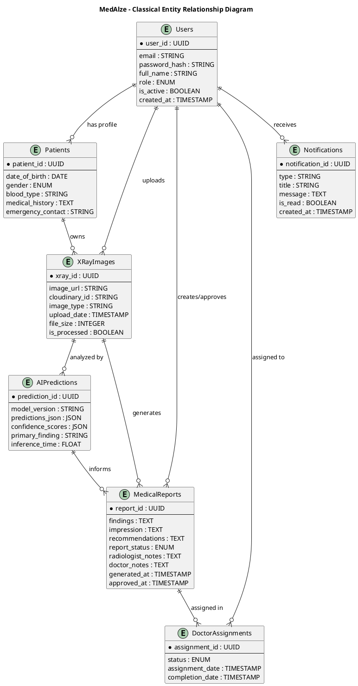
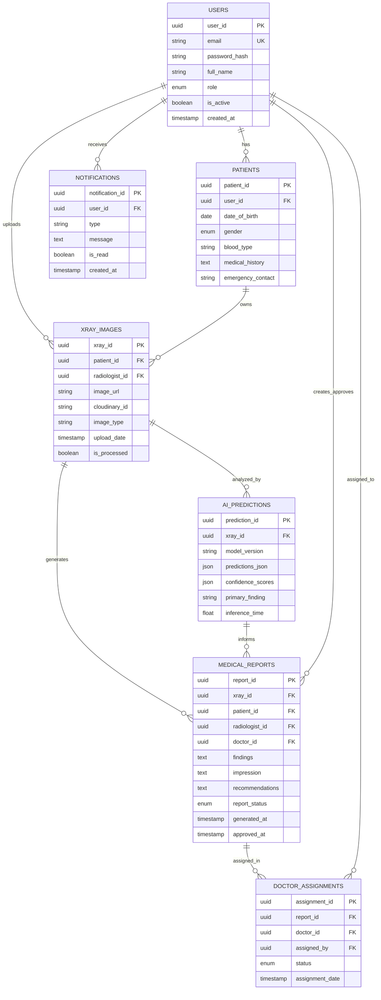

# MedAlze Entity Relationship Diagram - Classical Chen Style

## 1. Main ER Diagram - PlantUML Classical Format



---

## 2. Chen-Style Diagram Description

Below is the **textual representation** of the classical Chen ER diagram:

```
┌─────────────────────────────────────────────────────────────────┐
│                         MEDALLZE ER DIAGRAM                     │
│                      (Classical Chen Style)                      │
└─────────────────────────────────────────────────────────────────┘

ENTITIES (Rectangles):
═══════════════════════

┌──────────────────┐
│     USERS        │
├──────────────────┤
│ PK: user_id      │
│ email (UNIQUE)   │
│ password_hash    │
│ full_name        │
│ role             │
│ is_active        │
│ created_at       │
└──────────────────┘

┌──────────────────┐
│    PATIENTS      │
├──────────────────┤
│ PK: patient_id   │
│ FK: user_id      │
│ date_of_birth    │
│ gender           │
│ blood_type       │
│ medical_history  │
│ emergency_contact│
└──────────────────┘

┌──────────────────┐
│   XRAY_IMAGES    │
├──────────────────┤
│ PK: xray_id      │
│ FK: patient_id   │
│ FK: radiologist_id
│ image_url        │
│ cloudinary_id    │
│ image_type       │
│ upload_date      │
│ is_processed     │
└──────────────────┘

┌──────────────────┐
│  AI_PREDICTIONS  │
├──────────────────┤
│ PK: prediction_id│
│ FK: xray_id      │
│ model_version    │
│ predictions_json │
│ confidence_scores│
│ primary_finding  │
│ inference_time   │
└──────────────────┘

┌──────────────────┐
│ MEDICAL_REPORTS  │
├──────────────────┤
│ PK: report_id    │
│ FK: xray_id      │
│ FK: patient_id   │
│ FK: radiologist_id
│ FK: doctor_id    │
│ findings         │
│ impression       │
│ recommendations  │
│ report_status    │
│ generated_at     │
│ approved_at      │
└──────────────────┘

┌──────────────────┐
│ DOCTOR_ASSIGN    │
├──────────────────┤
│ PK: assignment_id│
│ FK: report_id    │
│ FK: doctor_id    │
│ FK: assigned_by  │
│ status           │
│ assignment_date  │
│ completion_date  │
└──────────────────┘

┌──────────────────┐
│  NOTIFICATIONS   │
├──────────────────┤
│ PK: notif_id     │
│ FK: user_id      │
│ type             │
│ message          │
│ is_read          │
│ created_at       │
└──────────────────┘


RELATIONSHIPS (Diamonds):
════════════════════════

         "has"
    USERS ──────────── PATIENTS
      │
      │ "uploads"
      │
    XRAY_IMAGES
      │
      ├─ "owned by" → PATIENTS
      │
      ├─ "analyzed" → AI_PREDICTIONS
      │
      └─ "generates" → MEDICAL_REPORTS
                          │
                          ├─ "informed by" → AI_PREDICTIONS
                          │
                          ├─ "created by" → USERS (Radiologist)
                          │
                          ├─ "approved by" → USERS (Doctor)
                          │
                          └─ "assigned in" → DOCTOR_ASSIGNMENTS
                                               │
                                               └─ "assigned to" → USERS (Doctor)

    USERS ──────────── NOTIFICATIONS
            "receives"


CARDINALITY NOTATION:
════════════════════

Entity1 ──── 1:N ──── Entity2
(One-to-Many)

Entity1 ──── 1:1 ──── Entity2
(One-to-One)

Entity1 ──── M:N ──── Entity2
(Many-to-Many)
```

---

## 3. Draw.io Native ER Diagram Format

Here's a Draw.io compatible format using native ER shapes:

```
Go to Draw.io → Shapes Panel → Search "ER" 
You'll find:
- Entity (Rectangle)
- Attribute (Oval)
- Relationship (Diamond)
- Line Connector

Build diagram like this:

[Oval: user_id] ─┐
[Oval: email]   ─┼─→ [Rectangle: USERS] ←─ [Diamond: has] ←─ [Rectangle: PATIENTS]
[Oval: role]    ─┘                                             ↓
                                                        [Oval: patient_id]
                                                        [Oval: dob]
                                                        [Oval: gender]
                                                               │
                                                               └─ [Diamond: owns] ← [Rectangle: XRAY_IMAGES]
                                                                                            │
                                                                                    [Oval: xray_id]
                                                                                    [Oval: image_url]
                                                                                    [Oval: upload_date]
```

---

## 4. Mermaid ER Diagram Format



---

## 5. How to Create in Draw.io

### Step-by-Step:

1. **Open Draw.io**
   - Go to https://draw.io/
   - Create new blank diagram

2. **Add ER Shapes** (from left panel)
   - Search for "entity" → drag ER Entity box
   - Search for "oval" → drag attributes
   - Search for "diamond" → drag relationship box

3. **Create Entities** (Rectangles)
   - Draw 7 rectangles
   - Label: USERS, PATIENTS, XRAY_IMAGES, AI_PREDICTIONS, MEDICAL_REPORTS, DOCTOR_ASSIGNMENTS, NOTIFICATIONS

4. **Add Attributes** (Ovals - outside entities)
   - For USERS: user_id (underlined/primary key), email, password_hash, full_name, role
   - For PATIENTS: patient_id, date_of_birth, gender, blood_type, medical_history
   - For XRAY_IMAGES: xray_id, image_url, cloudinary_id, upload_date
   - For AI_PREDICTIONS: prediction_id, predictions_json, confidence_scores
   - For MEDICAL_REPORTS: report_id, findings, impression, recommendations, status
   - For DOCTOR_ASSIGNMENTS: assignment_id, status, assignment_date
   - For NOTIFICATIONS: notification_id, type, message, is_read

5. **Connect Attributes to Entities**
   - Draw lines from each oval to its entity
   - (Like the image you showed)

6. **Add Relationships** (Diamonds)
   - Between USERS and PATIENTS: label "has"
   - Between USERS and XRAY_IMAGES: label "uploads"
   - Between PATIENTS and XRAY_IMAGES: label "owns"
   - Between XRAY_IMAGES and AI_PREDICTIONS: label "analyzed by"
   - Between XRAY_IMAGES and MEDICAL_REPORTS: label "generates"
   - Between MEDICAL_REPORTS and DOCTOR_ASSIGNMENTS: label "assigned in"

7. **Add Cardinality**
   - 1 to N (one-to-many)
   - 1 to 1 (one-to-one)
   - Label on connecting lines

8. **Format & Export**
   - Right-click entities → Format cells → colors
   - File → Export as PNG/SVG

---

## 6. Classical ER Symbols

```
Entity          ┌──────────┐
(Rectangle)     │  Entity  │
                └──────────┘

Attribute       ╭─────────╮
(Oval)          │ Attribute│
                ╰─────────╯

Relationship    ◇─────────◇
(Diamond)       │ Relation │
                ◇─────────◇

Weak Entity     ┌──────┬──────┐
(Double Box)    │Entity│Entity│
                └──────┴──────┘

Primary Key     ┌──────────┐
(Underlined)    │ *user_id │
                └──────────┘

Foreign Key     ┌──────────┐
(Dashed box)    │ #doctor_id
                └──────────┘

Cardinality:
1:1 (One to One)
1:N (One to Many)
M:N (Many to Many)
```

---

## 7. Your Diagram Structure (Like Your Image)

```
                    ┌─────────────┐
                    │ Attributes  │
                    └─────────────┘
                         / | \
                        /  |  \
            ┌─────────┐ ┌──┴──┐ ┌──────────┐
            │user_id  │ │ ... │ │ doctor_id│
            └─────────┘ └─────┘ └──────────┘
                 \       |       /
                  \      |      /
                   ▼     ▼     ▼
                  ┌──────────────┐
                  │    USERS     │◇────── "has" ─────◇┌──────────┐
                  ├──────────────┤                      │ PATIENTS │
                  │ PK: user_id  │                      └──────────┘
                  │ email        │
                  │ password     │
                  │ full_name    │
                  │ role         │
                  └──────────────┘
                        │
                        │ "uploads"
                        ◇
                  ┌──────────────┐
                  │XRAY_IMAGES   │
                  ├──────────────┤
                  │ PK: xray_id  │
                  │ image_url    │
                  │ upload_date  │
                  └──────────────┘
                        │
                   ┌────┴─────┬────────────┐
                   │           │            │
              "analyzed" "generates"   ...
                   ◇           ◇
                   │           │
            ┌──────────┐  ┌──────────────┐
            │PREDICTIONS │ │MEDICAL_REPORTS
            └──────────┘  └──────────────┘
                             │
                        "assigned_in"
                             ◇
                        ┌────────────────┐
                        │ DOCTOR_ASSIGN  │
                        └────────────────┘
```

---

## Quick Reference: Cardinality Symbols

```
1:1 Relationship    Entity1 ──── Entity2
(One to One)

1:N Relationship    Entity1 ──┬─ Entity2
(One to Many)                 │
                              └─ Entity2

M:N Relationship    Entity1 ┬─┼─┬ Entity2
(Many to Many)              │ │ │
                            └─┼─┘
```

---

**Perfect for Draw.io visualization!** 🎨
