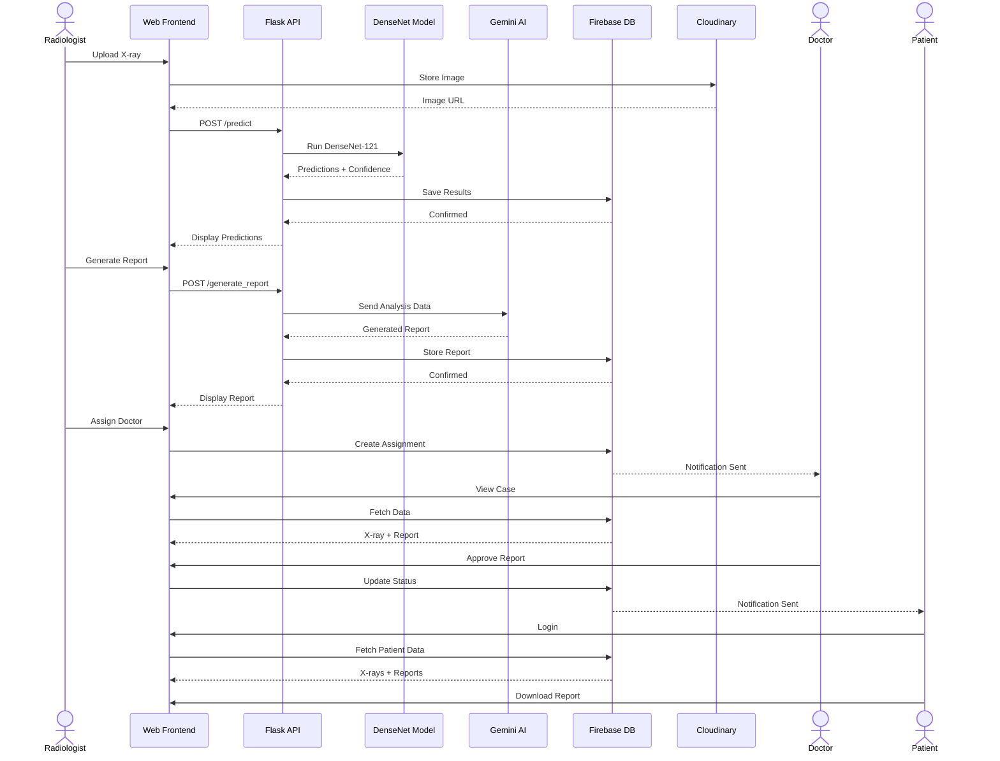
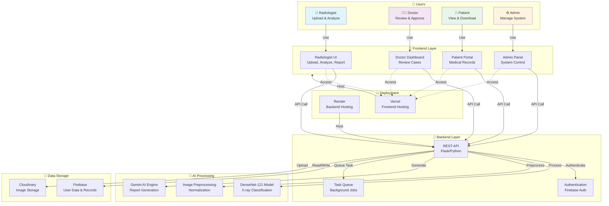
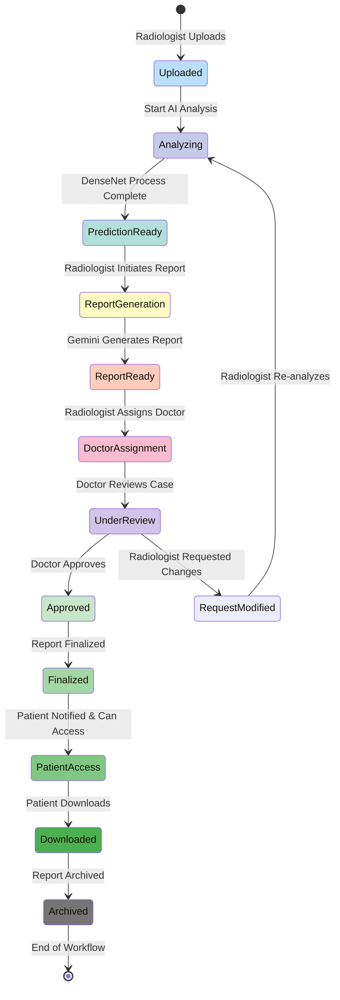
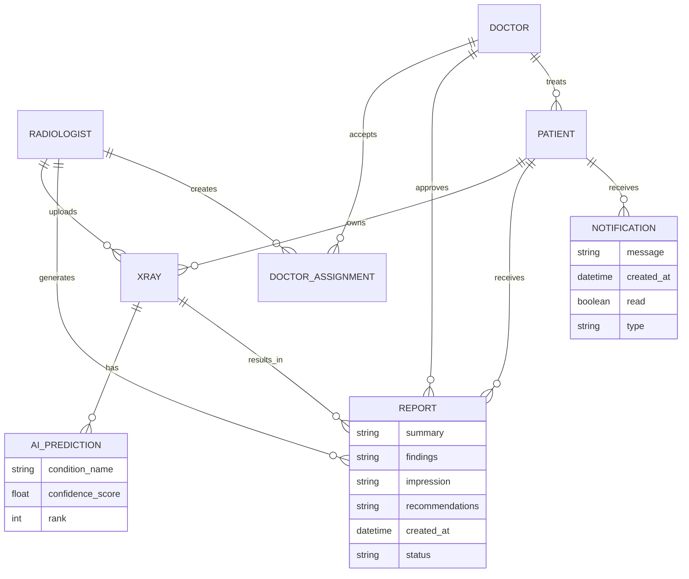

# MedAlze Use Case Diagram - Mermaid Code

## 1. Main Use Case Diagram (Recommended)

```mermaid
graph TB
    subgraph Actors["👥 Actors"]
        Radiologist["🏥 Radiologist"]
        Doctor["👨‍⚕️ Doctor"]
        Patient["👤 Patient"]
        Admin["⚙️ Admin"]
    end
    
    subgraph UseCases["📋 Use Cases"]
        UC1["Upload X-ray"]
        UC2["View AI Prediction"]
        UC3["Generate Report"]
        UC4["Assign Doctor"]
        UC5["View Patient X-rays"]
        UC6["Review Predictions"]
        UC7["Approve/Comment Report"]
        UC8["Register/Login"]
        UC9["View X-ray History"]
        UC10["Receive Notifications"]
        UC11["Download Reports"]
        UC12["Manage Users"]
        UC13["Monitor Reports"]
        UC14["View Analytics"]
    end
    
    subgraph System["🔧 System Components"]
        API["Flask API Backend"]
        AI["DenseNet-121 Model"]
        Gemini["Gemini AI Engine"]
        DB["Firebase Database"]
        Storage["Cloudinary Storage"]
    end
    
    Radiologist --> UC1
    Radiologist --> UC2
    Radiologist --> UC3
    Radiologist --> UC4
    
    Doctor --> UC5
    Doctor --> UC6
    Doctor --> UC7
    
    Patient --> UC8
    Patient --> UC9
    Patient --> UC10
    Patient --> UC11
    
    Admin --> UC12
    Admin --> UC13
    Admin --> UC14
    
    UC1 --> Storage
    UC2 --> AI
    UC3 --> Gemini
    UC4 --> DB
    UC5 --> DB
    UC6 --> AI
    UC7 --> DB
    UC8 --> DB
    UC9 --> DB
    UC10 --> DB
    UC11 --> DB
    UC12 --> DB
    UC13 --> DB
    UC14 --> DB
```



---

## 2. Radiologist Use Cases (Detailed)

```mermaid
usecase diagram
    actor Radiologist as R
    
    package "X-ray Management" {
        usecase "Upload X-ray" as UC1
        usecase "Select Patient" as UC1a
        usecase "Associate Metadata" as UC1b
    }
    
    package "AI Analysis" {
        usecase "View AI Prediction" as UC2
        usecase "View Confidence Scores" as UC2a
        usecase "View All Conditions" as UC2b
    }
    
    package "Report Generation" {
        usecase "Generate Report" as UC3
        usecase "Review Generated Report" as UC3a
        usecase "Approve Report" as UC3b
    }
    
    package "Case Management" {
        usecase "Assign Doctor" as UC4
        usecase "Add Comments" as UC4a
    }
    
    R --> UC1
    UC1 --> UC1a
    UC1 --> UC1b
    
    R --> UC2
    UC2 --> UC2a
    UC2 --> UC2b
    
    R --> UC3
    UC3 --> UC3a
    UC3 --> UC3b
    
    R --> UC4
    UC4 --> UC4a
```

---

## 3. Doctor Use Cases (Detailed)

```mermaid
usecase diagram
    actor Doctor as D
    
    package "Case Review" {
        usecase "View Patient X-rays" as UC1
        usecase "Access X-ray List" as UC1a
        usecase "Filter by Date/Condition" as UC1b
    }
    
    package "AI Analysis Review" {
        usecase "Review Predictions" as UC2
        usecase "Check Confidence Scores" as UC2a
        usecase "Compare with Clinical Expertise" as UC2b
    }
    
    package "Report Review" {
        usecase "Consult Patient Reports" as UC3
        usecase "Read Medical Assessment" as UC3a
        usecase "Review Recommendations" as UC3b
    }
    
    package "Report Approval" {
        usecase "Approve/Comment" as UC4
        usecase "Add Clinical Notes" as UC4a
        usecase "Request Modifications" as UC4b
    }
    
    D --> UC1
    UC1 --> UC1a
    UC1 --> UC1b
    
    D --> UC2
    UC2 --> UC2a
    UC2 --> UC2b
    
    D --> UC3
    UC3 --> UC3a
    UC3 --> UC3b
    
    D --> UC4
    UC4 --> UC4a
    UC4 --> UC4b
```

---

## 4. Patient Use Cases (Detailed)

```mermaid
usecase diagram
    actor Patient as P
    
    package "Authentication" {
        usecase "Register Account" as UC1
        usecase "Complete Profile" as UC1a
        usecase "Verify Email" as UC1b
        usecase "Login" as UC2
    }
    
    package "Medical Records" {
        usecase "View X-ray History" as UC3
        usecase "Filter X-rays" as UC3a
        usecase "View X-ray Details" as UC3b
    }
    
    package "Notifications" {
        usecase "Receive Status Updates" as UC4
        usecase "X-ray Assigned Notification" as UC4a
        usecase "Report Ready Notification" as UC4b
    }
    
    package "Report Access" {
        usecase "Download Reports" as UC5
        usecase "View Report Content" as UC5a
        usecase "Share Reports" as UC5b
    }
    
    P --> UC1
    UC1 --> UC1a
    UC1 --> UC1b
    
    P --> UC2
    
    P --> UC3
    UC3 --> UC3a
    UC3 --> UC3b
    
    P --> UC4
    UC4 --> UC4a
    UC4 --> UC4b
    
    P --> UC5
    UC5 --> UC5a
    UC5 --> UC5b
```

---

## 5. Admin Use Cases (Detailed)

```mermaid
usecase diagram
    actor Admin as A
    
    package "User Management" {
        usecase "Manage Users" as UC1
        usecase "View All Users" as UC1a
        usecase "Approve Radiologists" as UC1b
        usecase "Manage Permissions" as UC1c
    }
    
    package "System Monitoring" {
        usecase "Monitor Reports" as UC2
        usecase "Track Report Status" as UC2a
        usecase "Monitor Performance" as UC2b
    }
    
    package "Analytics & Reporting" {
        usecase "View Dashboard" as UC3
        usecase "System Statistics" as UC3a
        usecase "Generate Reports" as UC3b
    }
    
    A --> UC1
    UC1 --> UC1a
    UC1 --> UC1b
    UC1 --> UC1c
    
    A --> UC2
    UC2 --> UC2a
    UC2 --> UC2b
    
    A --> UC3
    UC3 --> UC3a
    UC3 --> UC3b
```

---

## 6. System Data Flow (Sequence)



---

## 7. Complete System Architecture with Use Cases



---

## 8. State Diagram - X-ray Processing Workflow



---

## 9. Entity Relationship for Use Cases



---

## 10. How to Use These Mermaid Diagrams

### In Markdown:
```markdown
\`\`\`mermaid
[Paste the diagram code here]
\`\`\`
```

### In GitHub:
- Copy the diagram code into your README.md or documentation files
- GitHub will automatically render Mermaid diagrams

### In Other Platforms:
- **Notion**: Use Mermaid embed
- **Obsidian**: Use Mermaid plugin
- **Confluence**: Use Mermaid macro
- **GitLab**: Supported natively
- **Draw.io**: Import Mermaid code
- **Mermaid Live Editor**: https://mermaid.live (paste code to preview)

---

## Summary

You now have **10 comprehensive Mermaid diagrams**:

1. ✅ **Main Use Case Diagram** - Complete system overview
2. ✅ **Radiologist Detailed** - Specific use cases
3. ✅ **Doctor Detailed** - Specific use cases  
4. ✅ **Patient Detailed** - Specific use cases
5. ✅ **Admin Detailed** - Specific use cases
6. ✅ **Sequence Diagram** - Data flow between components
7. ✅ **System Architecture** - Complete tech stack integration
8. ✅ **State Diagram** - X-ray processing workflow
9. ✅ **Entity Relationship** - Database relationships
10. ✅ **Implementation Guide** - How to embed them

**Choose the one that best fits your documentation needs!** 🎯
