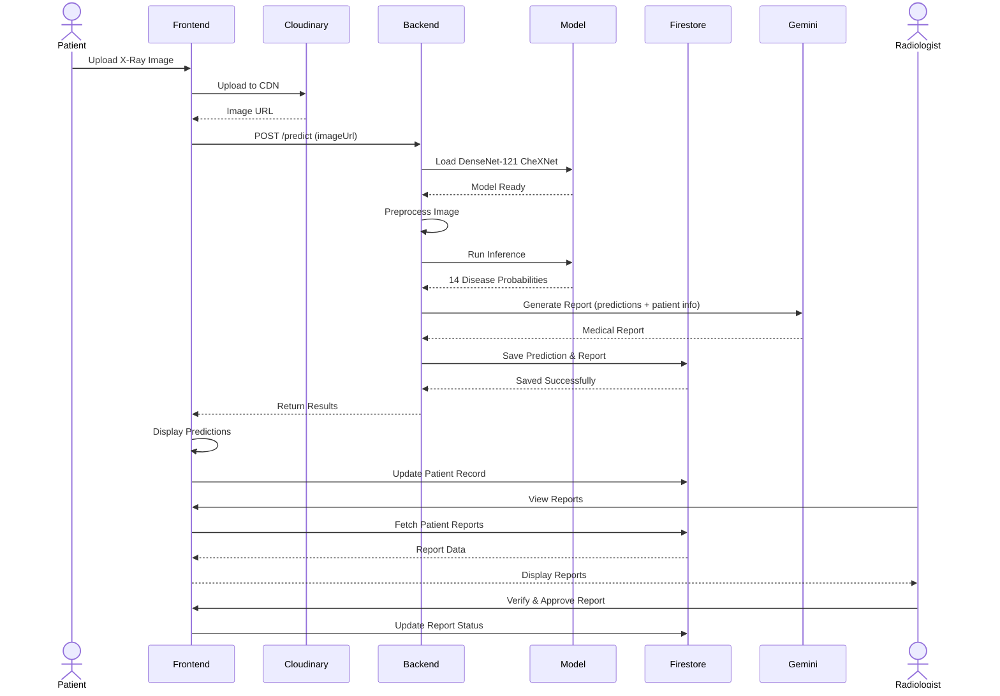
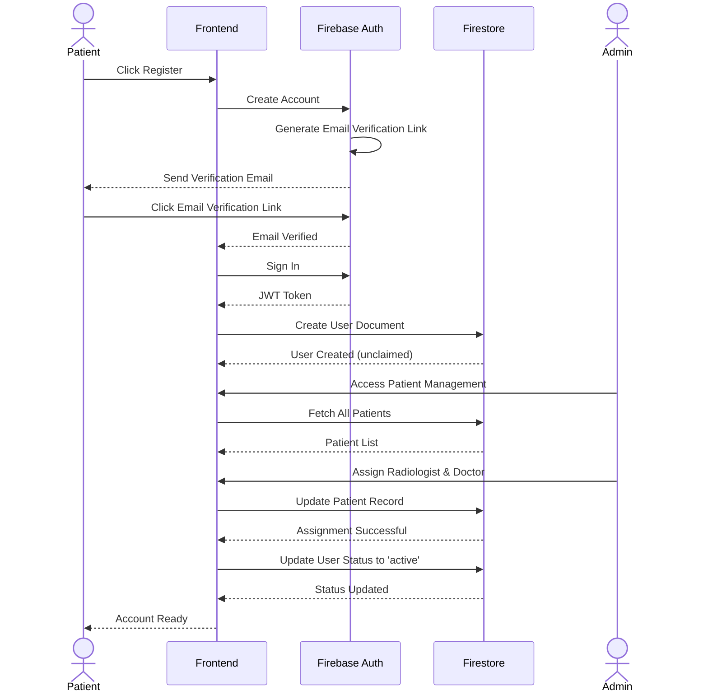
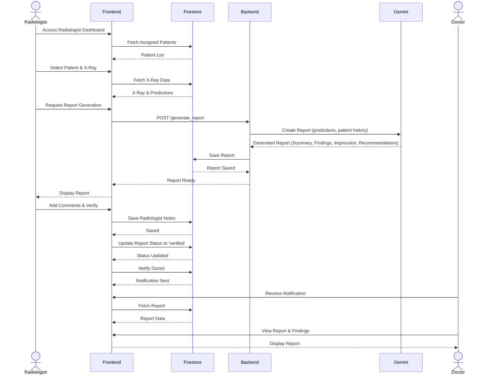
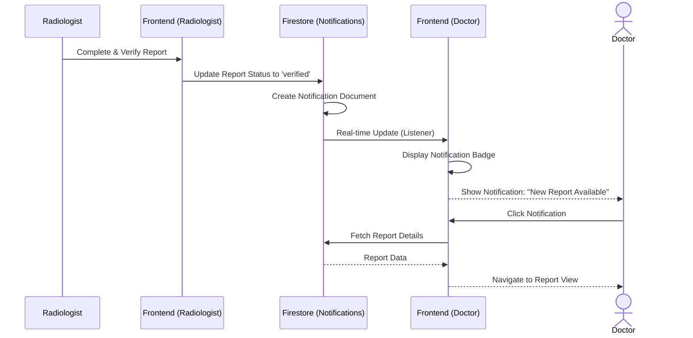
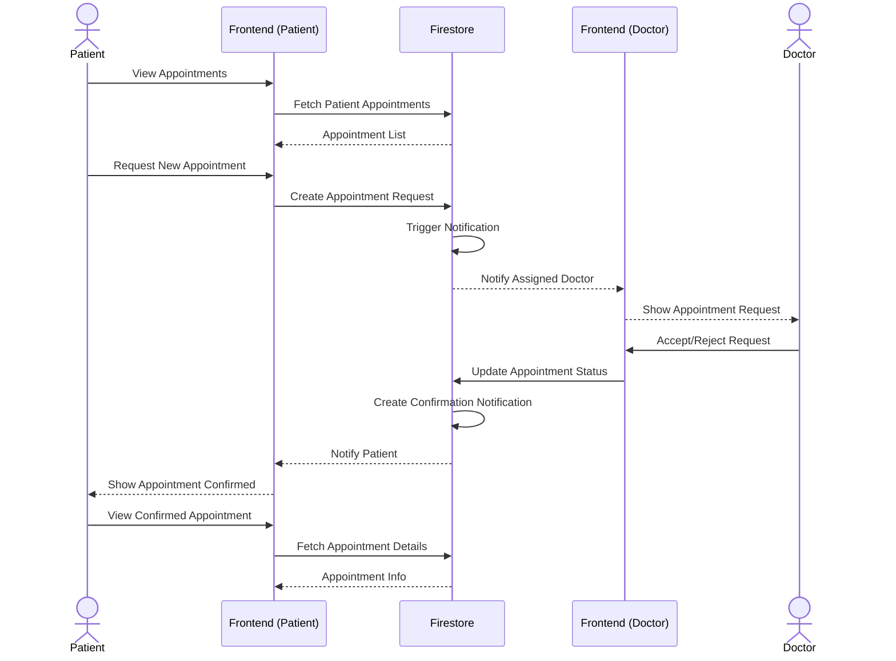
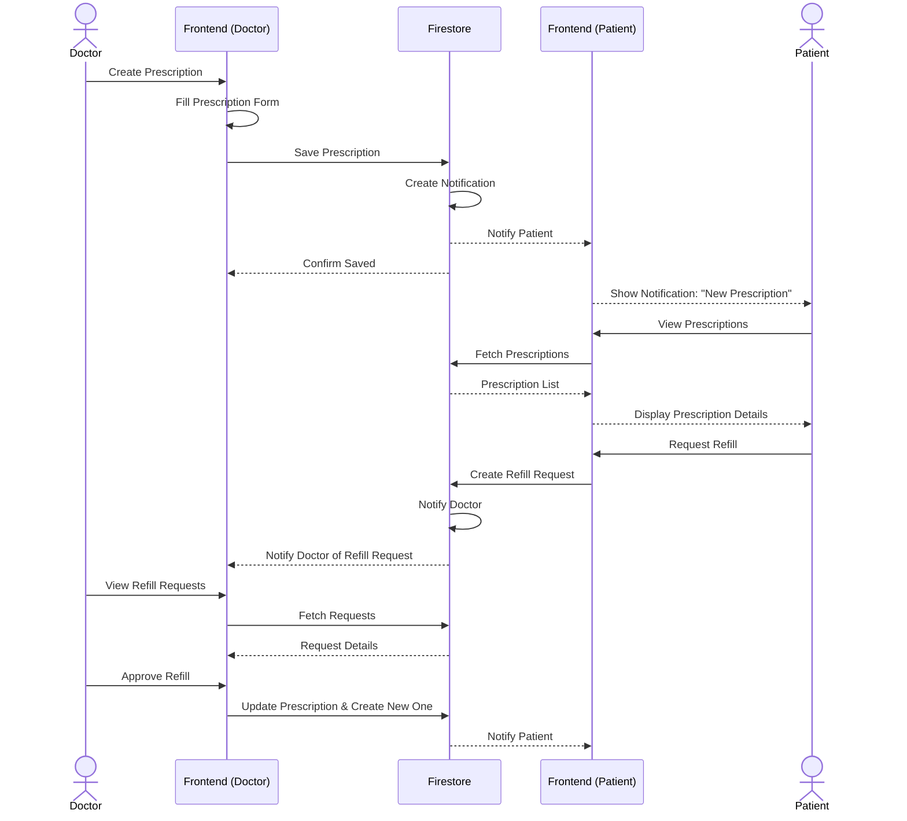
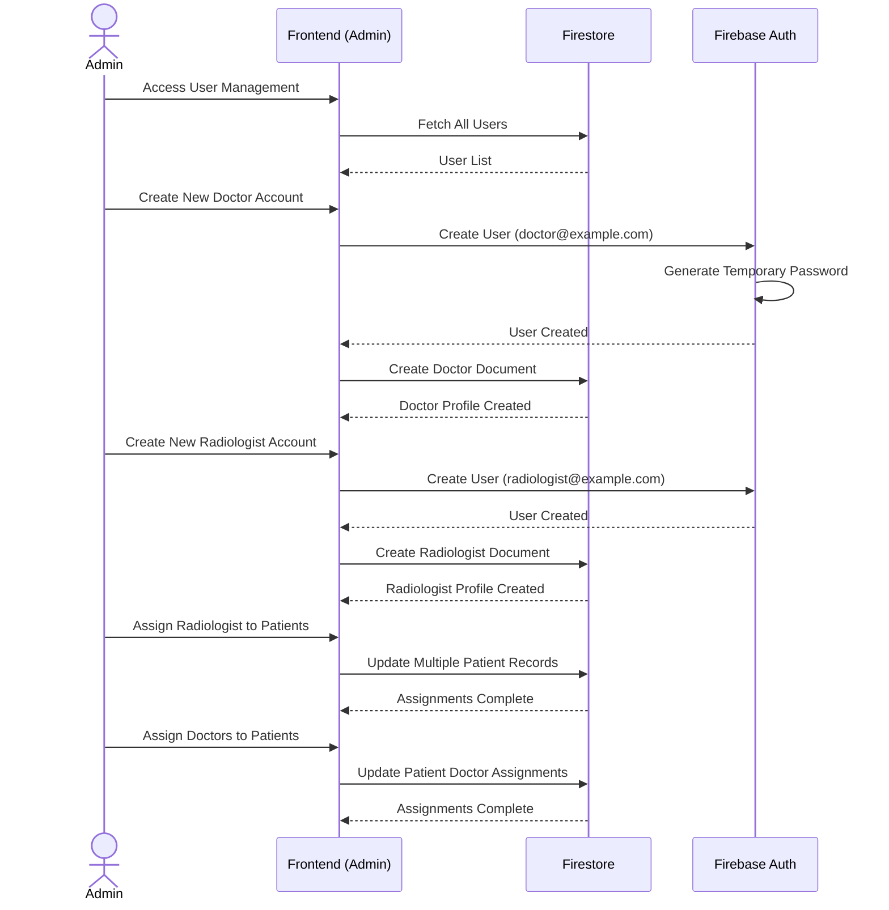
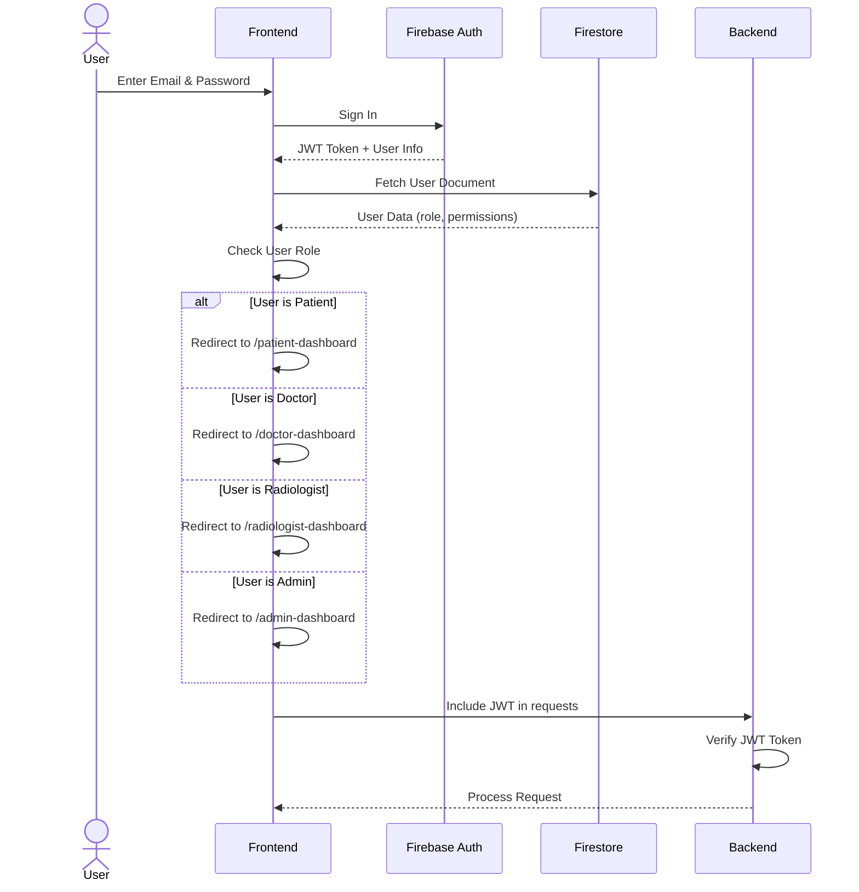
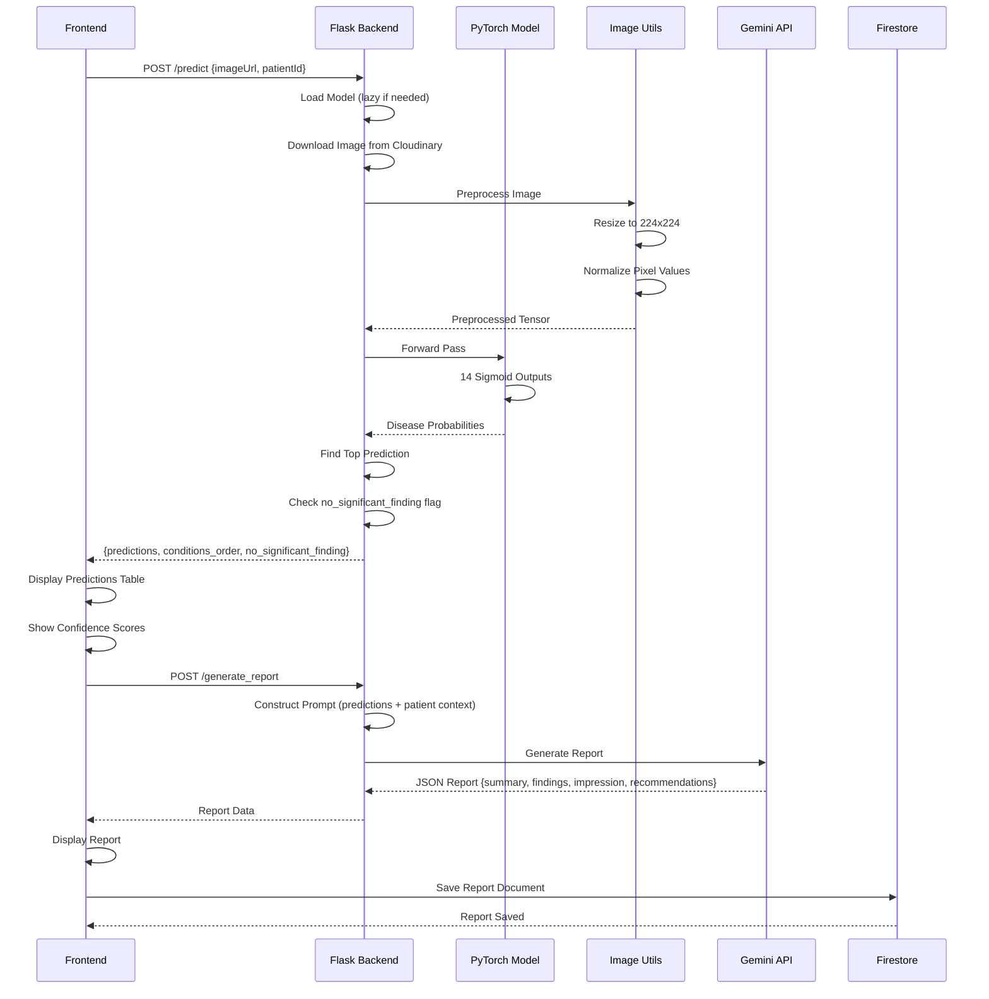
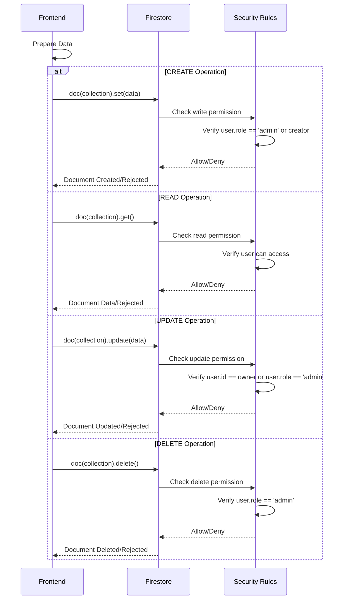

# MedALze - Sequence Diagrams

## 1. X-Ray Upload and Analysis Workflow

## 2. Patient Registration and Role Assignment Workflow

## 3. Report Generation and Review Workflow

## 4. Real-Time Notification Workflow

## 5. Appointment Management Workflow

## 6. Prescription Management Workflow

## 7. Admin User Management Workflow

## 8. Complete Authentication Flow

## 9. X-Ray Analysis Detail Flow

## 10. Database Schema and CRUD Operations

---

## Key Components in Diagrams

### Actors
- **Patient**: End user seeking medical consultation
- **Doctor**: Physician who reviews reports and creates prescriptions
- **Radiologist**: Specialist who analyzes X-rays and verifies reports
- **Admin**: System administrator managing users and assignments

### Systems
- **Frontend (React)**: User interface deployed on Vercel
- **Backend (Flask)**: API server deployed on Render
- **Firebase**: Authentication and real-time database
- **Cloudinary**: Image hosting and CDN
- **PyTorch Model**: DenseNet-121 CheXNet for predictions
- **Gemini API**: LLM for report generation

### Key Flows
1. **Prediction Pipeline**: Image Upload → Preprocessing → Model Inference → Report Generation
2. **Notification System**: Database updates → Real-time listeners → UI notifications
3. **Role-Based Access**: Authentication → Role check → Feature availability
4. **Data Security**: Firebase security rules → Permission validation → CRUD operations

---

## Performance Metrics

| Operation | Duration | Notes |
|-----------|----------|-------|
| Image Upload | 2-3s | Cloudinary upload |
| Model Load | 10-20s | First request only (lazy loading) |
| Model Inference | <100ms | Per image prediction |
| Report Generation | 3-5s | Gemini API call |
| Database Query | <100ms | Firestore indexed query |
| **Total End-to-End** | **7-8s** | After model load |

