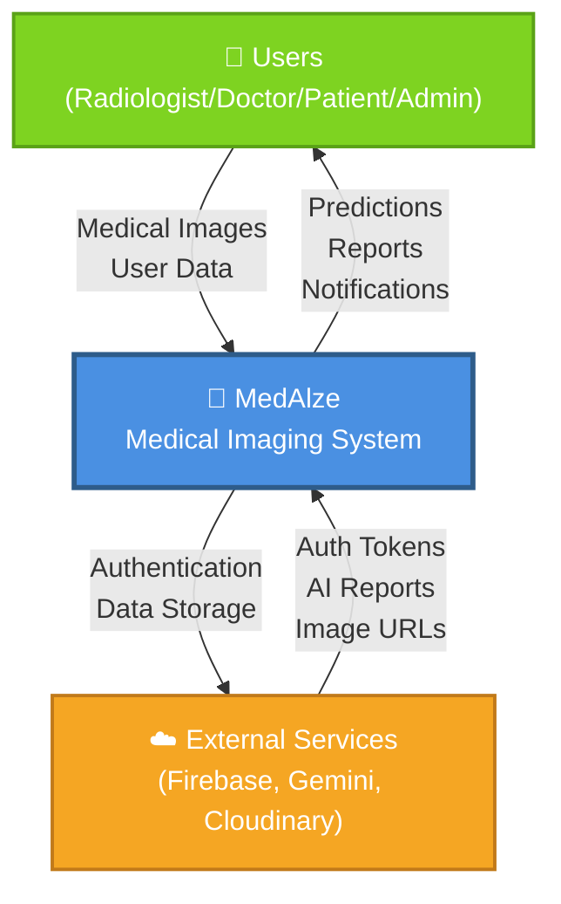
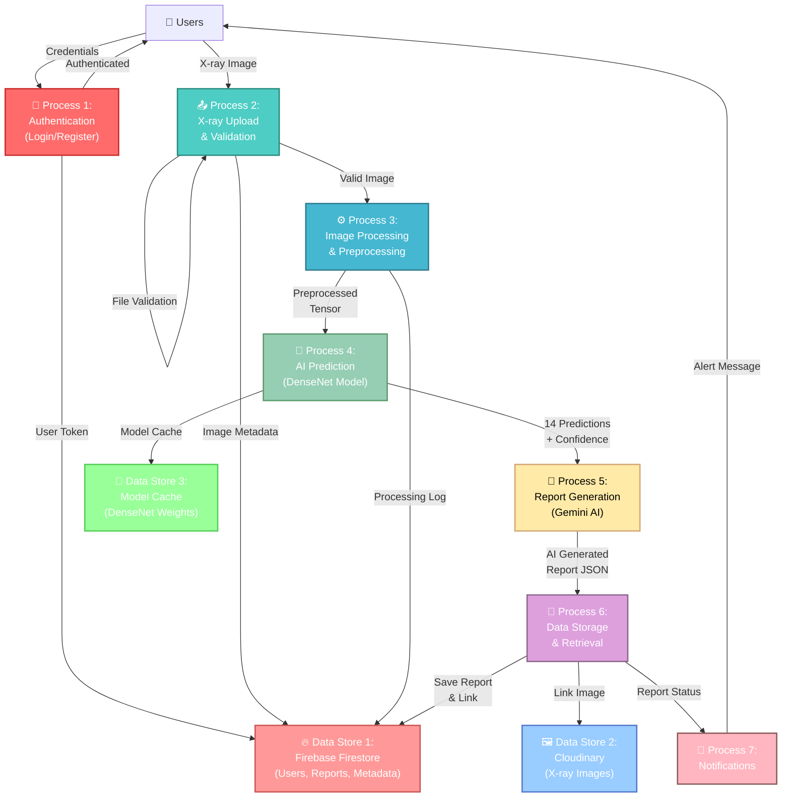
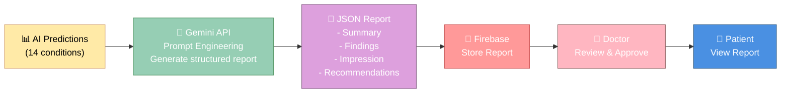
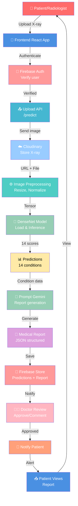

# MedAlze: Data Flow Diagrams (DFD) & AI Model Architecture

## Part 1: Data Flow Diagram (DFD) - Level 0 (Context Diagram)



---

## Part 2: Data Flow Diagram (DFD) - Level 1 (Detailed Processes)



---

## Part 3: Detailed Data Flows

### 3.1: X-ray Upload to Prediction Flow


### 3.2: Report Generation Flow



---

## Part 4: AI Model Architecture (DenseNet-121 / CheXNet)

### 4.1: Model Structure Diagram

```
INPUT LAYER
    ↓
[Chest X-ray Image]
(224 × 224 × 3 pixels)
    ↓
PREPROCESSING
    ├─ Resize to 224×224
    ├─ Normalize (ImageNet mean/std)
    └─ Convert to PyTorch Tensor
    ↓
DENSE BLOCK 1
    ├─ Convolutional Layer (64 filters, 7×7)
    ├─ Batch Normalization
    ├─ ReLU Activation
    └─ Max Pooling (3×3)
    ↓
DENSE BLOCK 2 (12 layers)
    ├─ Dense Connections (growth rate = 32)
    ├─ 1×1 → 3×3 Convolution
    ├─ Batch Normalization
    └─ ReLU Activation
    ↓
TRANSITION LAYER 1
    ├─ Compression (0.5x)
    └─ Average Pooling
    ↓
DENSE BLOCK 3 (12 layers)
    └─ [Same as DENSE BLOCK 2]
    ↓
TRANSITION LAYER 2
    └─ [Same as TRANSITION LAYER 1]
    ↓
DENSE BLOCK 4 (24 layers)
    └─ [Same as DENSE BLOCK 2]
    ↓
TRANSITION LAYER 3
    └─ [Same as TRANSITION LAYER 1]
    ↓
DENSE BLOCK 5 (16 layers)
    └─ [Same as DENSE BLOCK 2]
    ↓
GLOBAL AVERAGE POOLING
    └─ Output: (1024,)
    ↓
FULLY CONNECTED LAYERS
    ├─ Dense Layer (1024 → 512)
    ├─ ReLU Activation
    ├─ Dropout (0.5)
    └─ Dense Layer (512 → 14)
    ↓
SIGMOID ACTIVATION
    └─ Multi-label classification
    ↓
OUTPUT LAYER
    ↓
14 CONDITION PREDICTIONS (Probability Scores 0-1)
    ├─ Atelectasis
    ├─ Cardiomegaly
    ├─ Effusion
    ├─ Infiltration
    ├─ Mass
    ├─ Nodule
    ├─ Pneumonia
    ├─ Pneumothorax
    ├─ Consolidation
    ├─ Edema
    ├─ Emphysema
    ├─ Fibrosis
    ├─ Pleural_Thickening
    └─ Hernia
```

### 4.2: DenseNet Architecture Mermaid

```mermaid
graph TB
    Input["📥 Input<br/>224×224×3"]
    Conv1["Conv 7×7, stride=2<br/>64 channels"]
    Pool1["Max Pool 3×3"]
    DB1["Dense Block 1<br/>12 layers"]
    Trans1["Transition<br/>Compression"]
    DB2["Dense Block 2<br/>12 layers"]
    Trans2["Transition<br/>Compression"]
    DB3["Dense Block 3<br/>24 layers"]
    Trans3["Transition<br/>Compression"]
    DB4["Dense Block 4<br/>16 layers"]
    GAP["Global Avg Pool"]
    FC1["Fully Connected<br/>1024 → 512"]
    Drop["Dropout 0.5"]
    FC2["Fully Connected<br/>512 → 14"]
    Sigmoid["Sigmoid<br/>Multi-label"]
    Output["📤 Output<br/>14 Predictions"]
    
    Input --> Conv1
    Conv1 --> Pool1
    Pool1 --> DB1
    DB1 --> Trans1
    Trans1 --> DB2
    DB2 --> Trans2
    Trans2 --> DB3
    Trans3 --> DB4
    DB3 --> Trans3
    DB4 --> GAP
    GAP --> FC1
    FC1 --> Drop
    Drop --> FC2
    FC2 --> Sigmoid
    Sigmoid --> Output
    
    style Input fill:#FF6B6B,color:#fff
    style Conv1 fill:#4ECDC4,color:#fff
    style DB1 fill:#45B7D1,color:#fff
    style DB2 fill:#45B7D1,color:#fff
    style DB3 fill:#45B7D1,color:#fff
    style DB4 fill:#45B7D1,color:#fff
    style FC1 fill:#96CEB4,color:#fff
    style FC2 fill:#FFEAA7,color:#000
    style Output fill:#FF9999,color:#fff
```



### 4.3: Model Parameters & Performance

```
┌────────────────────────────────────────────────────┐
│         DenseNet-121 / CheXNet Specifications      │
├────────────────────────────────────────────────────┤
│ Architecture       │ DenseNet-121 (Pre-trained)    │
│ Input Size         │ 224 × 224 × 3 (RGB)           │
│ Total Parameters   │ ~7.97 million                  │
│ Model Size         │ ~27 MB (.pth file)             │
│ Pre-training Data  │ NIH ChestX-ray14 Dataset       │
│ Training Images    │ 112,120 chest X-rays           │
│ Number of Classes  │ 14 conditions (multi-label)    │
│ Output Layer       │ Sigmoid (multi-label)          │
│ Inference Time     │ 50-200ms per image             │
│ Memory Required    │ ~500MB (GPU) / 300MB (CPU)     │
│ Framework          │ PyTorch 2.0+                   │
├────────────────────────────────────────────────────┤
│ Conditions Detected (14 Labels):                   │
│ 1. Atelectasis     8. Pneumothorax                 │
│ 2. Cardiomegaly    9. Consolidation                │
│ 3. Effusion       10. Edema                        │
│ 4. Infiltration   11. Emphysema                    │
│ 5. Mass           12. Fibrosis                     │
│ 6. Nodule         13. Pleural Thickening           │
│ 7. Pneumonia      14. Hernia                       │
├────────────────────────────────────────────────────┤
│ Accuracy Metrics (on ChestX-ray14):                │
│ Average AUC       │ ~0.76 (across conditions)      │
│ Sensitivity       │ 70-85% (condition-dependent)   │
│ Specificity       │ 80-95% (condition-dependent)   │
└────────────────────────────────────────────────────┘
```

### 4.4: Pre/Post-Processing Pipeline

```mermaid
graph LR
    subgraph Preprocessing["🔄 Preprocessing"]
        P1["Load Image<br/>.jpg/.png"]
        P2["Resize<br/>→ 224×224"]
        P3["Normalize<br/>ImageNet stats"]
        P4["Convert<br/>→ Tensor"]
    end
    
    subgraph Model["🧠 DenseNet Model"]
        M1["Forward Pass<br/>through layers"]
    end
    
    subgraph Postprocessing["📊 Post-processing"]
        Post1["Sigmoid<br/>Activation"]
        Post2["Confidence<br/>Scores 0-1"]
        Post3["Sort by<br/>Confidence"]
        Post4["Format<br/>JSON Output"]
    end
    
    Input["📥 Input<br/>X-ray Image"]
    Output["📤 Output<br/>14 Predictions"]
    
    Input --> P1
    P1 --> P2
    P2 --> P3
    P3 --> P4
    P4 --> M1
    M1 --> Post1
    Post1 --> Post2
    Post2 --> Post3
    Post3 --> Post4
    Post4 --> Output
    
    style Preprocessing fill:#4ECDC4,stroke:#2B8A7E,stroke-width:2px,color:#fff
    style Model fill:#96CEB4,stroke:#5A9A6B,stroke-width:2px,color:#fff
    style Postprocessing fill:#FFEAA7,stroke:#D4A574,stroke-width:2px,color:#000
    style Input fill:#FF6B6B,stroke:#C92A2A,color:#fff
    style Output fill:#FF9999,stroke:#CC5555,color:#fff
```



---

## Part 5: Full System Data Pipeline



---

## Part 6: Summary Table - Diagrams for Thesis

| Diagram Type | Purpose | Uses For Thesis |
|--------------|---------|-----------------|
| **DFD Level 0** | System context | Show high-level overview |
| **DFD Level 1** | Process breakdown | Explain system components |
| **Sequence Flows** | Step-by-step workflows | Detail X-ray processing |
| **AI Model Architecture** | Model structure | Explain ML component |
| **Data Pipeline** | End-to-end flow | System integration |
| **ERD** | Database design | Data organization |
| **Use Case Diagram** | User interactions | Functional requirements |
| **Deployment Architecture** | System deployment | Infrastructure setup |

---

**These diagrams provide comprehensive documentation for your thesis!** 📊
