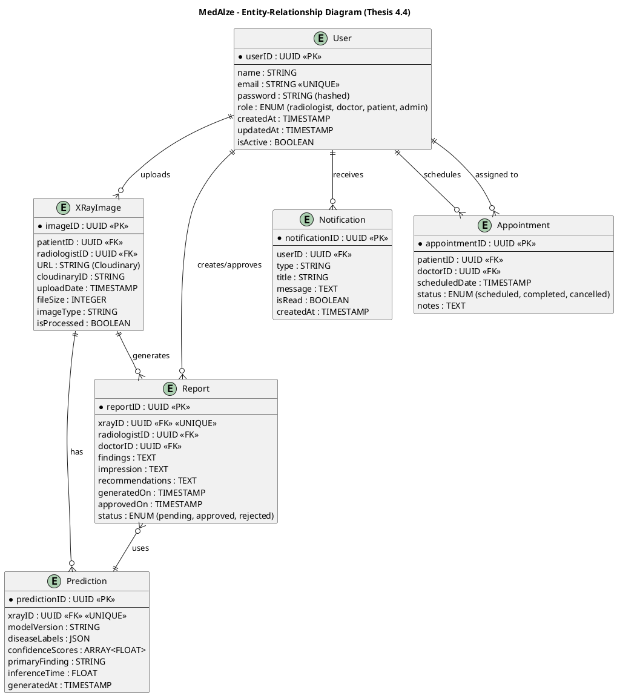
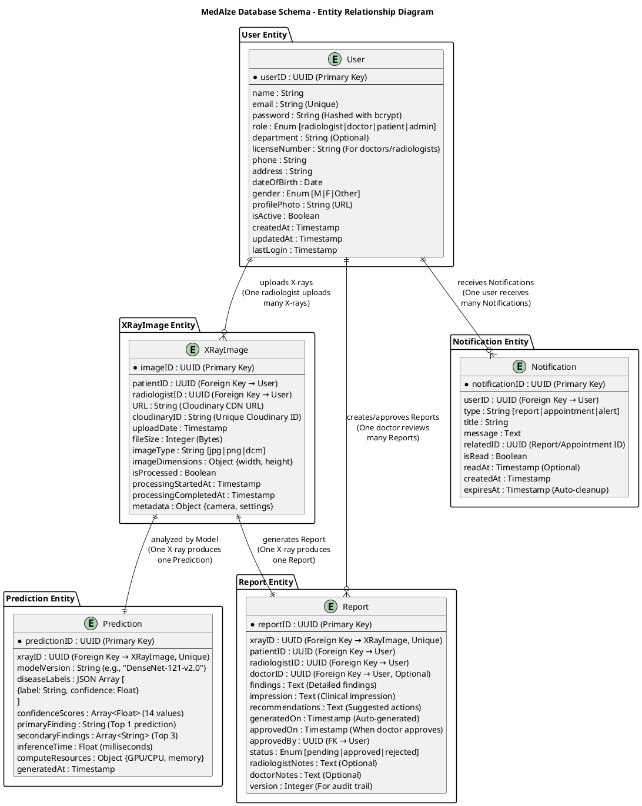

# MedAlze Entity-Relationship Diagram (ERD) - Thesis Section 4.4

## 1. Classical Chen-Style ERD (Best for Thesis)



---

## 2. Detailed ERD with All Attributes (Thesis Version)



---

## 3. Mermaid ERD (Alternative Format)

```mermaid
erDiagram
    USER {
        string userID PK
        string name
        string email UK
        string password
        string role
        string department
        string phone
        timestamp createdAt
        timestamp updatedAt
    }
    
    XRAY_IMAGE {
        string imageID PK
        string patientID FK
        string radiologistID FK
        string URL
        string cloudinaryID UK
        timestamp uploadDate
        integer fileSize
        string imageType
        boolean isProcessed
    }
    
    REPORT {
        string reportID PK
        string xrayID FK UK
        string patientID FK
        string radiologistID FK
        string doctorID FK
        text findings
        text impression
        text recommendations
        timestamp generatedOn
        timestamp approvedOn
        string status
    }
    
    PREDICTION {
        string predictionID PK
        string xrayID FK UK
        string modelVersion
        json diseaseLabels
        array confidenceScores
        string primaryFinding
        float inferenceTime
        timestamp generatedAt
    }
    
    NOTIFICATION {
        string notificationID PK
        string userID FK
        string type
        string title
        text message
        boolean isRead
        timestamp createdAt
    }
    
    USER ||--o{ XRAY_IMAGE : "uploads"
    USER ||--o{ REPORT : "creates/approves"
    USER ||--o{ NOTIFICATION : "receives"
    XRAY_IMAGE ||--|| REPORT : "generates"
    XRAY_IMAGE ||--|| PREDICTION : "has"
    REPORT }o--|| PREDICTION : "uses"
```

---

## 4. Relationship Details Table

```
┌─────────────────────────────────────────────────────────────────────────────┐
│                    MedAlze Database Relationships                           │
├─────────────────────────────────────────────────────────────────────────────┤
│ Relationship Type │ From Entity  │ To Entity     │ Cardinality │ Description │
├─────────────────────────────────────────────────────────────────────────────┤
│ Upload            │ User         │ XRayImage     │ 1:M         │ Radiologist │
│                   │              │               │             │ uploads many│
│                   │              │               │             │ X-rays      │
├─────────────────────────────────────────────────────────────────────────────┤
│ Generate          │ XRayImage    │ Report        │ 1:1         │ Each X-ray  │
│                   │              │               │             │ produces    │
│                   │              │               │             │ one Report  │
├─────────────────────────────────────────────────────────────────────────────┤
│ Analyze           │ XRayImage    │ Prediction    │ 1:1         │ Each X-ray  │
│                   │              │               │             │ analyzed    │
│                   │              │               │             │ by model    │
├─────────────────────────────────────────────────────────────────────────────┤
│ Create/Approve    │ User         │ Report        │ 1:M         │ Doctor can  │
│                   │              │               │             │ approve     │
│                   │              │               │             │ many Reports│
├─────────────────────────────────────────────────────────────────────────────┤
│ Receive           │ User         │ Notification  │ 1:M         │ User gets   │
│                   │              │               │             │ many notifs │
├─────────────────────────────────────────────────────────────────────────────┤
│ References        │ Report       │ Prediction    │ M:1         │ Report uses │
│                   │              │               │             │ prediction  │
│                   │              │               │             │ data        │
└─────────────────────────────────────────────────────────────────────────────┘
```

---

## 5. Firebase Firestore Collection Structure

```
┌─────────────────────────────────────────────────────────────────────┐
│              Firebase Firestore Collections Structure               │
└─────────────────────────────────────────────────────────────────────┘

Database: medalze-db

├─ Collection: users
│  └─ Document: {userID}
│     ├─ name: String
│     ├─ email: String (indexed)
│     ├─ password: String
│     ├─ role: String
│     ├─ department: String
│     ├─ phone: String
│     ├─ profilePhoto: String (URL)
│     ├─ isActive: Boolean (indexed)
│     ├─ createdAt: Timestamp (indexed)
│     ├─ updatedAt: Timestamp
│     └─ lastLogin: Timestamp
│
├─ Collection: xray_images
│  └─ Document: {imageID}
│     ├─ patientID: Reference → users/{userID}
│     ├─ radiologistID: Reference → users/{userID}
│     ├─ URL: String
│     ├─ cloudinaryID: String (indexed)
│     ├─ uploadDate: Timestamp (indexed)
│     ├─ fileSize: Number
│     ├─ imageType: String
│     ├─ imageDimensions: Object {width, height}
│     ├─ isProcessed: Boolean
│     ├─ processingStartedAt: Timestamp
│     ├─ processingCompletedAt: Timestamp
│     └─ metadata: Object
│
├─ Collection: reports
│  └─ Document: {reportID}
│     ├─ xrayID: Reference → xray_images/{imageID}
│     ├─ patientID: Reference → users/{userID}
│     ├─ radiologistID: Reference → users/{userID}
│     ├─ doctorID: Reference → users/{userID}
│     ├─ findings: String
│     ├─ impression: String
│     ├─ recommendations: String
│     ├─ generatedOn: Timestamp
│     ├─ approvedOn: Timestamp
│     ├─ approvedBy: Reference → users/{userID}
│     ├─ status: String [pending|approved|rejected]
│     ├─ radiologistNotes: String
│     ├─ doctorNotes: String
│     └─ version: Number
│
├─ Collection: predictions
│  └─ Document: {predictionID}
│     ├─ xrayID: Reference → xray_images/{imageID}
│     ├─ modelVersion: String
│     ├─ diseaseLabels: Array [
│     │  {
│     │    label: "Atelectasis",
│     │    confidence: 0.85
│     │  },
│     │  ...
│     │ ]
│     ├─ confidenceScores: Array<Number> (14 values)
│     ├─ primaryFinding: String
│     ├─ secondaryFindings: Array<String>
│     ├─ inferenceTime: Number (ms)
│     └─ generatedAt: Timestamp
│
├─ Collection: notifications
│  └─ Document: {notificationID}
│     ├─ userID: Reference → users/{userID}
│     ├─ type: String [report|appointment|alert]
│     ├─ title: String
│     ├─ message: String
│     ├─ relatedID: Reference
│     ├─ isRead: Boolean
│     ├─ readAt: Timestamp
│     ├─ createdAt: Timestamp
│     └─ expiresAt: Timestamp
│
└─ Collection: appointments
   └─ Document: {appointmentID}
      ├─ patientID: Reference → users/{userID}
      ├─ doctorID: Reference → users/{userID}
      ├─ scheduledDate: Timestamp
      ├─ status: String
      ├─ notes: String
      └─ createdAt: Timestamp
```

---

## 6. SQL Schema (For Reference)

```sql
-- User Table
CREATE TABLE User (
    userID VARCHAR(36) PRIMARY KEY,
    name VARCHAR(255) NOT NULL,
    email VARCHAR(255) UNIQUE NOT NULL,
    password VARCHAR(255) NOT NULL,
    role ENUM('radiologist', 'doctor', 'patient', 'admin') NOT NULL,
    department VARCHAR(100),
    licenseNumber VARCHAR(100),
    phone VARCHAR(20),
    address TEXT,
    dateOfBirth DATE,
    gender ENUM('M', 'F', 'Other'),
    profilePhoto VARCHAR(500),
    isActive BOOLEAN DEFAULT TRUE,
    createdAt TIMESTAMP DEFAULT CURRENT_TIMESTAMP,
    updatedAt TIMESTAMP DEFAULT CURRENT_TIMESTAMP ON UPDATE CURRENT_TIMESTAMP,
    lastLogin TIMESTAMP,
    INDEX idx_email (email),
    INDEX idx_role (role),
    INDEX idx_isActive (isActive)
);

-- XRayImage Table
CREATE TABLE XRayImage (
    imageID VARCHAR(36) PRIMARY KEY,
    patientID VARCHAR(36) NOT NULL,
    radiologistID VARCHAR(36) NOT NULL,
    URL VARCHAR(500) NOT NULL,
    cloudinaryID VARCHAR(200) UNIQUE NOT NULL,
    uploadDate TIMESTAMP DEFAULT CURRENT_TIMESTAMP,
    fileSize INT,
    imageType ENUM('jpg', 'png', 'dcm'),
    imageDimensions JSON,
    isProcessed BOOLEAN DEFAULT FALSE,
    processingStartedAt TIMESTAMP,
    processingCompletedAt TIMESTAMP,
    metadata JSON,
    FOREIGN KEY (patientID) REFERENCES User(userID),
    FOREIGN KEY (radiologistID) REFERENCES User(userID),
    INDEX idx_patientID (patientID),
    INDEX idx_radiologistID (radiologistID),
    INDEX idx_uploadDate (uploadDate)
);

-- Report Table
CREATE TABLE Report (
    reportID VARCHAR(36) PRIMARY KEY,
    xrayID VARCHAR(36) NOT NULL UNIQUE,
    patientID VARCHAR(36) NOT NULL,
    radiologistID VARCHAR(36) NOT NULL,
    doctorID VARCHAR(36),
    findings TEXT,
    impression TEXT,
    recommendations TEXT,
    generatedOn TIMESTAMP DEFAULT CURRENT_TIMESTAMP,
    approvedOn TIMESTAMP,
    approvedBy VARCHAR(36),
    status ENUM('pending', 'approved', 'rejected') DEFAULT 'pending',
    radiologistNotes TEXT,
    doctorNotes TEXT,
    version INT DEFAULT 1,
    FOREIGN KEY (xrayID) REFERENCES XRayImage(imageID),
    FOREIGN KEY (patientID) REFERENCES User(userID),
    FOREIGN KEY (radiologistID) REFERENCES User(userID),
    FOREIGN KEY (doctorID) REFERENCES User(userID),
    FOREIGN KEY (approvedBy) REFERENCES User(userID),
    INDEX idx_xrayID (xrayID),
    INDEX idx_status (status),
    INDEX idx_generatedOn (generatedOn)
);

-- Prediction Table
CREATE TABLE Prediction (
    predictionID VARCHAR(36) PRIMARY KEY,
    xrayID VARCHAR(36) NOT NULL UNIQUE,
    modelVersion VARCHAR(50),
    diseaseLabels JSON,
    confidenceScores JSON,
    primaryFinding VARCHAR(255),
    secondaryFindings JSON,
    inferenceTime FLOAT,
    computeResources JSON,
    generatedAt TIMESTAMP DEFAULT CURRENT_TIMESTAMP,
    FOREIGN KEY (xrayID) REFERENCES XRayImage(imageID),
    INDEX idx_xrayID (xrayID),
    INDEX idx_generatedAt (generatedAt)
);

-- Notification Table
CREATE TABLE Notification (
    notificationID VARCHAR(36) PRIMARY KEY,
    userID VARCHAR(36) NOT NULL,
    type ENUM('report', 'appointment', 'alert'),
    title VARCHAR(255),
    message TEXT,
    relatedID VARCHAR(36),
    isRead BOOLEAN DEFAULT FALSE,
    readAt TIMESTAMP,
    createdAt TIMESTAMP DEFAULT CURRENT_TIMESTAMP,
    expiresAt TIMESTAMP,
    FOREIGN KEY (userID) REFERENCES User(userID),
    INDEX idx_userID (userID),
    INDEX idx_isRead (isRead),
    INDEX idx_createdAt (createdAt)
);
```

---

## 7. Data Integrity & Constraints

```
┌─────────────────────────────────────────────────────────────────┐
│         Database Constraints & Data Integrity Rules             │
├─────────────────────────────────────────────────────────────────┤
│ Constraint Type │ Details                                       │
├─────────────────────────────────────────────────────────────────┤
│ Primary Key     │ Each entity has unique UUID identifier        │
│                 │ - userID, imageID, reportID, etc.            │
├─────────────────────────────────────────────────────────────────┤
│ Foreign Key     │ Referential integrity maintained              │
│                 │ - Report.xrayID → XRayImage.imageID          │
│                 │ - Prediction.xrayID → XRayImage.imageID      │
│                 │ - Report.doctorID → User.userID              │
├─────────────────────────────────────────────────────────────────┤
│ Unique          │ - User.email (no duplicate emails)            │
│ Constraint      │ - XRayImage.cloudinaryID (unique storage ID) │
│                 │ - Report.xrayID (one report per X-ray)       │
│                 │ - Prediction.xrayID (one prediction per img) │
├─────────────────────────────────────────────────────────────────┤
│ Not Null        │ Required fields:                              │
│ Constraint      │ - User: name, email, password, role          │
│                 │ - XRayImage: patientID, radiologistID, URL   │
│                 │ - Report: xrayID, findings, impression       │
│                 │ - Prediction: xrayID, diseaseLabels          │
├─────────────────────────────────────────────────────────────────┤
│ Enum/Check      │ - User.role: [radiologist|doctor|patient|admin
│ Constraint      │ - Report.status: [pending|approved|rejected] │
│                 │ - XRayImage.imageType: [jpg|png|dcm]         │
├─────────────────────────────────────────────────────────────────┤
│ Index           │ Performance optimization on:                  │
│                 │ - User.email, User.role, User.isActive       │
│                 │ - XRayImage.patientID, uploadDate            │
│                 │ - Report.status, generatedOn                 │
│                 │ - Notification.userID, createdAt             │
├─────────────────────────────────────────────────────────────────┤
│ Cascade Delete  │ - Delete User → Delete related XRayImages    │
│                 │ - Delete XRayImage → Delete Report, Predict  │
├─────────────────────────────────────────────────────────────────┤
│ Data Type       │ - UUIDs for all IDs (36 chars)               │
│ Standards       │ - Timestamps in UTC                          │
│                 │ - Email validation                           │
│                 │ - Password hashed with bcrypt                │
│                 │ - JSON for flexible data (labels, metadata)  │
└─────────────────────────────────────────────────────────────────┘
```

---

## 8. How to Use These Diagrams in Your Thesis

### **Best Option: Use Diagram #1 or #2**

**For Thesis Section 4.4:**

1. **Add Diagram #1 (Classical Chen-Style ERD)**
   - Professional appearance
   - Clear relationships shown with lines
   - All attributes visible
   - Easy to export as PNG/SVG

2. **Add the Relationship Details Table (Section 4)**
   - Explains each relationship
   - Shows cardinality (1:1, 1:M)
   - Includes descriptions

3. **Add Firebase Structure (Section 5)**
   - Shows actual implementation in Firestore
   - Explains collection names and fields
   - Relevant for implementation chapter

### **PlantUML Online Editor:**
1. Go to: https://www.plantuml.com/plantuml/uml/
2. Copy code from Diagram #1 or #2
3. Paste and click "Update"
4. Right-click → "Save image as PNG/SVG"

### **Caption for Figure 4.5:**

```
Figure 4.5 – Entity-Relationship Diagram (ERD) of MedAlze

The ERD illustrates the database schema of the MedAlze system, 
consisting of five main entities: User, XRayImage, Report, 
Prediction, and Notification. The User entity stores information 
about all system users (radiologists, doctors, patients, admins) 
with attributes including userID (primary key), name, email, 
password, role, and timestamps. The XRayImage entity contains 
records of uploaded chest X-rays with references to the 
radiologist who uploaded them. Each X-ray image has a one-to-one 
relationship with both a Report and a Prediction entity, ensuring 
data integrity and quick retrieval. The Report entity stores AI-
generated findings and clinical impressions, while the Prediction 
entity maintains the DenseNet model's confidence scores for 14 
different chest conditions. The Notification entity enables 
real-time alerts to users. The relationships are designed to 
maintain referential integrity, enable efficient queries, and 
ensure data consistency across the system. All relationships use 
UUID primary keys and implement cascade delete rules for data 
cleanup.
```

---

**Perfect for your thesis section 4.4!** 📊
