# MedAlze Backend Architecture - Section 5.3

## 1. Backend Architecture Diagram (PlantUML - 007FFF & White Colors)

```plantuml
@startuml MedAlze_Backend_Architecture
!define PRIMARY_COLOR #007FFF
!define SECONDARY_COLOR #FFFFFF
!define TEXT_COLOR #000000

skinparam {
  BackgroundColor #FFFFFF
  DefaultFontColor #000000
  ArrowColor #007FFF
  BorderColor #007FFF
}

title MedAlze Backend Architecture (Section 5.3.1)

' Client Layer
package "Client Layer" #WHITE {
  component "React Frontend\n(Vercel)" as Frontend
}

' API Gateway
package "API Gateway Layer" #007FFF {
  component "Flask REST API\nServer" as FlaskAPI
  component "Gunicorn WSGI\nApplication Server" as Gunicorn
}

' Middleware & Security
package "Security & Middleware Layer" #007FFF {
  component "Authentication\nMiddleware" as AuthMiddleware
  component "CORS Handler" as CORSHandler
  component "Request Validator" as ReqValidator
  component "Error Handler" as ErrorHandler
}

' API Endpoints
package "RESTful API Endpoints" #007FFF {
  component "POST /upload\n(X-ray Upload)" as UploadAPI
  component "POST /predict\n(AI Inference)" as PredictAPI
  component "GET /getPrediction\n(Fetch Results)" as GetPredAPI
  component "POST /users\n(Auth & User Mgmt)" as UsersAPI
  component "GET /health\n(System Health)" as HealthAPI
  component "POST /generateReport\n(Report Generation)" as ReportAPI
}

' Business Logic Layer
package "Business Logic Layer" #007FFF {
  component "Authentication\nService" as AuthService
  component "X-ray Upload\nHandler" as UploadHandler
  component "Image Processing\nEngine" as ImgProcessor
  component "AI Inference\nEngine" as AIEngine
  component "Report Generator\nService" as ReportService
  component "Notification\nService" as NotifService
}

' Data Access Layer
package "Data Access Layer" #007FFF {
  component "Firebase\nConnector" as FirebaseConn
  component "Cloudinary\nConnector" as CloudinaryConn
  component "Cache Manager" as CacheManager
  component "Model Loader" as ModelLoader
}

' External Services
package "External Services" #FFFFFF {
  component "Firebase Auth\n(User Management)" as FirebaseAuth
  component "Firebase Firestore\n(Database)" as Firestore
  component "Google Gemini API\n(Report AI)" as GeminiAPI
  component "Cloudinary CDN\n(Image Storage)" as CloudinaryCDN
}

' AI/ML Layer
package "AI/ML Processing Layer" #007FFF {
  component "Image Preprocessor" as ImgPreproc
  component "DenseNet-121 Model\n(PyTorch)" as DenseNetModel
  component "Prediction Formatter" as PredFormatter
}

' Data Storage (Internal)
package "Data Storage & Cache" #007FFF {
  component "Model Cache\n(DenseNet Weights)" as ModelCache
  component "Session Cache\n(Redis)" as SessionCache
  component "Request Queue" as ReqQueue
}

' Flow Connections
Frontend --> FlaskAPI: HTTP/REST Requests

FlaskAPI --> Gunicorn: Routes Requests

Gunicorn --> AuthMiddleware: Validate Token
Gunicorn --> CORSHandler: Handle CORS
Gunicorn --> ReqValidator: Validate Data
Gunicorn --> ErrorHandler: Handle Errors

AuthMiddleware --> AuthService: Authenticate User

AuthService --> FirebaseAuth: Verify Token
FirebaseAuth --> FirebaseConn: Update Session

' API Endpoint Flows
UploadAPI --> UploadHandler: Process Upload
PredictAPI --> AIEngine: Trigger Inference
GetPredAPI --> FirebaseConn: Fetch Results
UsersAPI --> AuthService: Manage Users
ReportAPI --> ReportService: Generate Report

' Business Logic Flows
UploadHandler --> CloudinaryConn: Upload Image
UploadHandler --> FirebaseConn: Save Metadata

ImgProcessor --> ImgPreproc: Preprocess
ImgPreproc --> DenseNetModel: Input Tensor

AIEngine --> ModelLoader: Load Model
AIEngine --> DenseNetModel: Run Inference
AIEngine --> PredFormatter: Format Output
AIEngine --> FirebaseConn: Store Predictions

ReportService --> GeminiAPI: Generate Report
ReportService --> FirebaseConn: Save Report

NotifService --> FirebaseConn: Send Notification

' Data Access Flows
FirebaseConn --> Firestore: Query/Store Data
CloudinaryConn --> CloudinaryCDN: Upload/Download Images
CacheManager --> ModelCache: Cache Model Weights
ModelLoader --> ModelCache: Load Cached Model

' Return to Client
FirebaseConn --> Gunicorn: Return Data
Gunicorn --> FlaskAPI: Response
FlaskAPI --> Frontend: JSON Response

' Styling
skinparam component {
  BackgroundColor #007FFF
  BorderColor #004080
  FontColor #FFFFFF
  ArrowColor #007FFF
}

skinparam package {
  BackgroundColor #F0F8FF
  BorderColor #007FFF
  FontColor #000000
}

@enduml
```



---

## 2. Detailed Backend Architecture with Color Scheme

```plantuml
@startuml MedAlze_Backend_Detailed
title MedAlze Backend Architecture - Detailed View

skinparam {
  BackgroundColor #FFFFFF
  DefaultFontColor #000000
}

' Colors: 007FFF (Blue) and FFFFFF (White)

package "Internet" {
  actor Client
}

package "Load Balancer" #007FFF {
  component "Reverse Proxy\n(nginx)" as LB
}

package "Application Server Tier" #007FFF {
  component "Flask App\nInstance 1" as Flask1
  component "Flask App\nInstance 2" as Flask2
  component "Flask App\nInstance 3" as Flask3
  component "Gunicorn\n(WSGI Server)" as Gunicorn
}

package "Middleware & Security" #007FFF {
  component "JWT Auth" as JWT
  component "Rate Limiter" as RateLimiter
  component "CORS Policy" as CORS
  component "Input Validator" as InputValidator
  component "Logging Service" as Logging
}

package "API Routes (RESTful)" #007FFF {
  component "/upload" as Upload
  component "/predict" as Predict
  component "/getPrediction" as GetPred
  component "/generateReport" as GenReport
  component "/users" as Users
  component "/health" as Health
}

package "Service Layer" #007FFF {
  component "Auth Service" as AuthSvc
  component "File Upload Service" as FileUploadSvc
  component "ML Pipeline Service" as MLSvc
  component "Report Service" as ReportSvc
  component "User Service" as UserSvc
}

package "Processing Layer" #007FFF {
  component "Image Processor" as ImgProc
  component "DenseNet Inference" as DenseNet
  component "Report Generator" as ReportGen
  component "Cache Manager" as Cache
}

package "Data Access Layer" #007FFF {
  component "Firebase DAO" as FirebaseDAO
  component "Cloudinary DAO" as CloudinaryDAO
  component "Cache DAO" as CacheDAO
}

package "External Services" #FFFFFF {
  component "Firebase\nAuthentication" as FB_Auth
  component "Firebase Firestore\nDatabase" as FB_DB
  component "Google Gemini\nAPI" as Gemini
  component "Cloudinary\nCDN" as Cloudinary
}

package "AI/ML Engine" #007FFF {
  component "PyTorch Runtime" as PyTorch
  component "Model Loader" as ModelLoader
  component "Inference Engine" as InferenceEngine
}

package "Storage & Cache" #007FFF {
  component "DenseNet Model\nCache" as ModelCache
  component "Redis Cache\n(Sessions)" as Redis
  component "Temporary Files" as TempFiles
}

' Connections
Client --> LB: HTTP Requests

LB --> Flask1
LB --> Flask2
LB --> Flask3

Flask1 --> Gunicorn: WSGI
Flask2 --> Gunicorn: WSGI
Flask3 --> Gunicorn: WSGI

Gunicorn --> JWT: Authenticate
Gunicorn --> RateLimiter: Rate Limit
Gunicorn --> CORS: CORS Check
Gunicorn --> InputValidator: Validate
Gunicorn --> Logging: Log

Gunicorn --> Upload
Gunicorn --> Predict
Gunicorn --> GetPred
Gunicorn --> GenReport
Gunicorn --> Users
Gunicorn --> Health

' API to Services
Upload --> FileUploadSvc
Predict --> MLSvc
GetPred --> AuthSvc
GenReport --> ReportSvc
Users --> UserSvc
Health --> Logging

' Services to Processing
FileUploadSvc --> ImgProc
MLSvc --> DenseNet
ReportSvc --> ReportGen
UserSvc --> AuthSvc
AuthSvc --> Firebase_Auth

' Processing to Data Access
ImgProc --> CloudinaryDAO
DenseNet --> Cache
DenseNet --> PyTorch
ReportGen --> Gemini

' Data Access to External
FirebaseDAO --> FB_Auth
FirebaseDAO --> FB_DB
CloudinaryDAO --> Cloudinary
CacheDAO --> Redis

' AI/ML Connections
ModelLoader --> PyTorch
PyTorch --> DenseNet
DenseNet --> ModelCache

' Return Path
FirebaseDAO --> Gunicorn: Data
CloudinaryDAO --> Gunicorn: URLs
CacheDAO --> Gunicorn: Cached Data

Gunicorn --> Client: HTTP Response

@enduml
```



---

## 3. API Endpoints Architecture Diagram

```plantuml
@startuml MedAlze_API_Endpoints
title MedAlze Backend API Endpoints Architecture

skinparam {
  BackgroundColor #FFFFFF
  DefaultFontColor #000000
  ArrowColor #007FFF
  BorderColor #007FFF
}

package "Frontend Application" #007FFF {
  component "React App" as Frontend
}

package "API Gateway\n(Flask REST)" #007FFF {
  component "Request Router" as Router
  component "Auth Validator" as AuthVal
}

package "POST /upload" #007FFF {
  component "Upload Handler" as UH
  component "File Validator" as FV
  component "Save to Cloudinary" as SC
  component "Store Metadata" as SM
}

package "POST /predict" #007FFF {
  component "Predict Handler" as PH
  component "Image Preprocessor" as IP
  component "DenseNet Model" as DM
  component "Format Output" as FO
  component "Save Results" as SR
}

package "GET /getPrediction" #007FFF {
  component "Get Handler" as GH
  component "Query Firestore" as QF
  component "Retrieve Data" as RD
}

package "POST /generateReport" #007FFF {
  component "Report Handler" as RH
  component "Build Prompt" as BP
  component "Call Gemini API" as CG
  component "Format Report" as FR
  component "Store Report" as StR
}

package "POST /users" #007FFF {
  component "User Handler" as UserH
  component "Auth Check" as AC
  component "Firebase Auth" as FA
  component "Create/Update User" as CU
}

package "GET /health" #007FFF {
  component "Health Check" as HC
  component "System Status" as SS
  component "Model Status" as MS
}

package "External Services" #FFFFFF {
  component "Cloudinary" as Cloud
  component "Firebase Firestore" as FB
  component "Google Gemini" as Gem
  component "Firebase Auth" as FAuth
}

' Request Flow
Frontend -->|POST {xrayFile, patientID}| Router
Router --> AuthVal: Validate Token
AuthVal -->|Valid| UH
UH --> FV: Validate File
FV -->|OK| SC
SC --> Cloud: Upload Image
Cloud -->|URL| SM
SM --> FB: Save Metadata
FB -->|Success| Router
Router -->|200: {xrayID, URL}| Frontend

Frontend -->|POST {xrayID}| Router
Router --> AuthVal
AuthVal -->|Valid| PH
PH --> QF: Get Image URL
QF --> FB
FB -->|Image URL| IP
IP -->|Tensor| DM
DM -->|14 Predictions| FO
FO -->|JSON| SR
SR --> FB: Store Predictions
FB -->|Success| Router
Router -->|200: {predictions}| Frontend

Frontend -->|GET /getPrediction?xrayID| Router
Router --> AuthVal
AuthVal -->|Valid| GH
GH --> QF
QF --> FB
FB -->|Prediction Data| RD
RD -->|Data| Router
Router -->|200: {predictions}| Frontend

Frontend -->|POST {predictions}| Router
Router --> AuthVal
AuthVal -->|Valid| RH
RH --> BP
BP -->|Prompt| CG
CG --> Gem
Gem -->|AI Report| FR
FR -->|Formatted| StR
StR --> FB
FB -->|Success| Router
Router -->|200: {reportID}| Frontend

Frontend -->|POST {email, password}| Router
Router --> UserH
UserH --> AC
AC -->|Valid| FA
FA --> FAuth
FAuth -->|Token| CU
CU --> FB
FB -->|User Created| Router
Router -->|200: {userID, token}| Frontend

Frontend -->|GET /health| Router
Router --> HC
HC --> SS
HC --> MS
Router -->|200: {status, model_ready}| Frontend

@enduml
```

---

## 4. Backend Request/Response Flow Diagram

```plantuml
@startuml MedAlze_Request_Flow
title MedAlze Backend - Complete Request/Response Flow

skinparam {
  BackgroundColor #FFFFFF
  DefaultFontColor #000000
}

actor User
participant "Frontend\n(React)" as Frontend
participant "Flask API\nServer" as Flask
participant "Authentication\nService" as Auth
participant "Business Logic\nService" as Logic
participant "External\nServices" as External
participant "Database\n(Firebase)" as DB

User --> Frontend: 1. Click Upload X-ray

Frontend --> Flask: 2. POST /upload\n{file, patientID}
activate Flask

Flask --> Auth: 3. Validate JWT Token
activate Auth
Auth --> External: 4. Verify with Firebase Auth
activate External
External --> Auth: 5. Token Valid ✓
deactivate External
Auth --> Flask: 6. User Authenticated
deactivate Auth

Flask --> Logic: 7. Process Upload
activate Logic
Logic --> External: 8. Upload to Cloudinary
External --> Logic: 9. Return Image URL
deactivate External

Logic --> DB: 10. Save Metadata\n{imageID, URL, patientID}
activate DB
DB --> Logic: 11. Saved Successfully
deactivate DB
Logic --> Flask: 12. Upload Complete
deactivate Logic

Flask --> Frontend: 13. Response 200\n{imageID, URL, status}
deactivate Flask

Frontend --> User: 14. Display "Upload Success"

---

User --> Frontend: 15. Click Predict

Frontend --> Flask: 16. POST /predict\n{xrayID}
activate Flask

Flask --> Auth: 17. Validate Token
activate Auth
Auth --> External: 18. Verify Token
External --> Auth: 19. Valid ✓
Auth --> Flask: 20. User Authorized
deactivate Auth

Flask --> Logic: 21. Start AI Inference
activate Logic
Logic --> DB: 22. Get Image URL
activate DB
DB --> Logic: 23. Return URL
deactivate DB

Logic --> External: 24. Download Image\nfrom Cloudinary
External --> Logic: 25. Image Data
deactivate External

Logic --> Logic: 26. Preprocess Image\n(Resize, Normalize)
Logic --> Logic: 27. Load DenseNet Model
Logic --> Logic: 28. Run Inference\n(Generate 14 predictions)

Logic --> DB: 29. Save Predictions\n{predictionID, scores, findings}
activate DB
DB --> Logic: 30. Saved ✓
deactivate DB
Logic --> Flask: 31. Predictions Ready
deactivate Logic

Flask --> Frontend: 32. Response 200\n{predictions, confidenceScores}
deactivate Flask

Frontend --> User: 33. Display Predictions\n(14 Conditions with Confidence %)

---

User --> Frontend: 34. Click Generate Report

Frontend --> Flask: 35. POST /generateReport\n{xrayID, predictions}
activate Flask

Flask --> Auth: 36. Validate Token
Auth --> Flask: 37. Authorized ✓

Flask --> Logic: 38. Generate Report
activate Logic
Logic --> DB: 39. Get Predictions
activate DB
DB --> Logic: 40. Prediction Data
deactivate DB

Logic --> External: 41. Call Gemini API\nwith Predictions
activate External
External --> Logic: 42. Generated Report\n(findings, impression, recommendations)
deactivate External

Logic --> DB: 43. Save Report\n{reportID, findings, impression, status}
activate DB
DB --> Logic: 44. Report Saved
deactivate DB
Logic --> Flask: 45. Report Generated
deactivate Logic

Flask --> Frontend: 46. Response 200\n{reportID, reportContent}
deactivate Flask

Frontend --> User: 47. Display Report\n(Ready for Doctor Review)

```

---

## 5. Backend Technology Stack

```
┌──────────────────────────────────────────────────────────────────┐
│          MedAlze Backend - Technology Stack (Section 5.3)        │
├──────────────────────────────────────────────────────────────────┤
│ Component                │ Technology               │ Purpose    │
├──────────────────────────────────────────────────────────────────┤
│ Web Framework            │ Flask (Python)          │ REST API   │
│ Application Server       │ Gunicorn                │ WSGI       │
│ API Gateway              │ Reverse Proxy (nginx)   │ Load Bal   │
│                          │                         │            │
│ Authentication           │ Firebase Auth           │ User Mgmt  │
│ Authorization            │ JWT Tokens              │ Security   │
│ CORS                     │ Flask-CORS              │ Security   │
│                          │                         │            │
│ Database                 │ Firebase Firestore      │ NoSQL      │
│ Cache                    │ Redis                   │ Sessions   │
│ File Storage             │ Cloudinary CDN          │ Images     │
│                          │                         │            │
│ AI/ML Framework          │ PyTorch 2.0+            │ Inference  │
│ ML Model                 │ DenseNet-121 (CheXNet)  │ Prediction │
│ Model Size               │ 27 MB                   │ .pth file  │
│ GPU Support              │ CUDA                    │ Speedup    │
│                          │                         │            │
│ Report Generation        │ Google Gemini API       │ AI Report  │
│ Report Format            │ JSON Structured         │ Serialized │
│                          │                         │            │
│ Logging                  │ Python logging module   │ Debug      │
│ Monitoring               │ Render monitoring       │ Health     │
│ Deployment               │ Render (PaaS)           │ Hosting    │
│                          │                         │            │
│ API Documentation        │ Flask Swagger/OpenAPI   │ Docs       │
│ Testing Framework        │ Pytest                  │ Unit tests │
└──────────────────────────────────────────────────────────────────┘
```

---

## 6. Backend Processing Pipeline (Detailed)

```plantuml
@startuml MedAlze_Processing_Pipeline
title MedAlze Backend - AI Processing Pipeline

skinparam {
  BackgroundColor #FFFFFF
}

rectangle "Input Stage" #007FFF {
  component "X-ray Image\nUpload" as Input
  component "File Validation" as Validate
  component "Extract Metadata" as ExtMeta
}

rectangle "Preprocessing Stage" #007FFF {
  component "Image Loading" as ImgLoad
  component "Resize to 224x224" as Resize
  component "Normalize\n(ImageNet Stats)" as Normalize
  component "Convert to Tensor" as ToTensor
}

rectangle "AI Inference Stage" #007FFF {
  component "Load DenseNet\nWeights" as LoadModel
  component "GPU/CPU\nCompute" as Compute
  component "Generate 14\nPredictions" as Predict
  component "Sigmoid\nActivation" as Sigmoid
}

rectangle "Post-processing Stage" #007FFF {
  component "Extract\nConfidence Scores" as ExtScore
  component "Rank Predictions" as Rank
  component "Format as JSON" as Format
  component "Add Metadata" as AddMeta
}

rectangle "Storage Stage" #007FFF {
  component "Validate Output" as ValidOut
  component "Store in\nFirebase" as Store
  component "Update Status" as UpdateStatus
  component "Ready for\nRadiologist" as Ready
}

Input --> Validate: File received
Validate --> ExtMeta: Valid format
ExtMeta --> ImgLoad: Metadata extracted

ImgLoad --> Resize: Image loaded
Resize --> Normalize: Resized
Normalize --> ToTensor: Normalized
ToTensor --> LoadModel: Tensor ready

LoadModel --> Compute: Weights loaded
Compute --> Predict: Forward pass
Predict --> Sigmoid: Raw predictions
Sigmoid --> ExtScore: Sigmoid applied

ExtScore --> Rank: Confidence scores
Rank --> Format: Ranked (top 14)
Format --> AddMeta: JSON formatted
AddMeta --> ValidOut: Metadata added

ValidOut --> Store: Output valid
Store --> UpdateStatus: Saved to Firestore
UpdateStatus --> Ready: Ready for review

@enduml
```



---

## 7. Text-Based Backend Architecture Summary

```
┌─────────────────────────────────────────────────────────────────────┐
│         MedAlze Backend Architecture - High Level Overview           │
│                    (Section 5.3.1 - Figure 5.5)                     │
└─────────────────────────────────────────────────────────────────────┘

TIER 1: CLIENT REQUEST
═══════════════════════════════════════════════════════════════════════
└─ React Frontend → HTTP/REST Request → Flask Backend

TIER 2: API GATEWAY & SECURITY (Flask + Gunicorn)
═══════════════════════════════════════════════════════════════════════
┌─ Request Reception
│  ├─ JWT Token Validation
│  ├─ CORS Policy Check
│  ├─ Rate Limiting
│  ├─ Input Validation
│  └─ Request Routing
│
└─ Routes Requests to API Endpoints:
   ├─ POST /upload → File Upload Service
   ├─ POST /predict → ML Inference Service
   ├─ GET /getPrediction → Database Query Service
   ├─ POST /generateReport → Report Generation Service
   ├─ POST /users → User Management Service
   └─ GET /health → System Health Check

TIER 3: BUSINESS LOGIC SERVICES
═══════════════════════════════════════════════════════════════════════
┌─ Authentication Service
│  └─ Integrates with Firebase Auth
│     └─ Manages JWT tokens & user sessions
│
├─ X-ray Upload Handler
│  ├─ Validates file format & size
│  ├─ Uploads to Cloudinary CDN
│  └─ Stores metadata in Firebase Firestore
│
├─ Image Processing Engine
│  ├─ Resizes image to 224×224 pixels
│  ├─ Normalizes pixel values (ImageNet stats)
│  └─ Converts to PyTorch tensor format
│
├─ AI Inference Engine (DenseNet-121)
│  ├─ Lazy-loads pre-trained model (27 MB)
│  ├─ Runs forward pass on tensor
│  ├─ Generates 14 disease predictions
│  └─ Applies sigmoid activation for probabilities
│
├─ Report Generator Service
│  ├─ Receives prediction scores
│  ├─ Builds structured prompt for Gemini API
│  ├─ Calls Google Gemini 2.0-Flash
│  └─ Formats response as JSON report
│
└─ Notification Service
   ├─ Notifies radiologist of predictions
   ├─ Alerts doctor when report ready
   └─ Informs patient when approved

TIER 4: DATA ACCESS LAYER
═══════════════════════════════════════════════════════════════════════
├─ Firebase Connector
│  ├─ Query user data
│  ├─ Store predictions
│  ├─ Persist reports
│  └─ Manage sessions
│
├─ Cloudinary Connector
│  ├─ Upload X-ray images
│  ├─ Generate image URLs
│  └─ Manage file storage
│
└─ Cache Manager
   ├─ Cache DenseNet model weights
   ├─ Store Redis sessions
   └─ Manage temporary files

TIER 5: EXTERNAL SERVICES
═══════════════════════════════════════════════════════════════════════
├─ Firebase Services (Google Cloud)
│  ├─ Firebase Authentication (User management)
│  ├─ Firebase Firestore (NoSQL database)
│  └─ Cloud Storage (Backup)
│
├─ Cloudinary (Third-party CDN)
│  ├─ Image optimization
│  ├─ URL generation
│  └─ Bandwidth optimization
│
└─ Google Gemini API
   ├─ Medical report generation
   ├─ Natural language processing
   └─ Structured JSON output

TIER 6: AI/ML PROCESSING
═══════════════════════════════════════════════════════════════════════
├─ PyTorch Runtime
│  ├─ GPU support (CUDA)
│  └─ CPU fallback
│
├─ DenseNet-121 Model
│  ├─ Pre-trained on ChestX-ray14 dataset
│  ├─ 121 dense layers
│  ├─ Outputs 14 probability scores (0-1)
│  └─ Inference time: 50-200ms
│
└─ Processing Components
   ├─ Image Preprocessor (resize, normalize)
   ├─ Model Loader (weights management)
   └─ Prediction Formatter (confidence scores)

TIER 7: DEPLOYMENT ENVIRONMENT
═══════════════════════════════════════════════════════════════════════
├─ Hosting: Render (PaaS)
├─ Application Server: Gunicorn (1 worker, 300s timeout)
├─ Framework: Flask (lightweight, flexible)
├─ Language: Python 3.9+
├─ Environment: Production (gunicorn) / Development (flask)
└─ Monitoring: Render built-in metrics

═══════════════════════════════════════════════════════════════════════

SECURITY FEATURES:
• JWT Token-based authentication
• Firebase Auth integration
• CORS policy enforcement
• Input validation on all endpoints
• Rate limiting (prevent abuse)
• HTTPS/TLS encryption
• Role-based access control (radiologist, doctor, patient, admin)
• Secure password hashing (bcrypt)
• API key management (Gemini, Cloudinary)

PERFORMANCE OPTIMIZATIONS:
• Model caching (DenseNet weights in memory)
• Redis sessions (fast user session lookup)
• Image CDN (Cloudinary optimization)
• Lazy loading (model loads on first request)
• Batch processing support
• Connection pooling (database)

RELIABILITY:
• Error handling on all endpoints
• Comprehensive logging
• Health check endpoint (/health)
• Graceful shutdown handling
• Database transaction support
• Request timeout management (300s)

═══════════════════════════════════════════════════════════════════════
```

---

## 8. How to Use These Diagrams in Your Thesis

### **For Section 5.3.1 - Backend Implementation:**

**Best Diagram to Use:** Diagram #1 (Backend Architecture Diagram)
- Shows all layers (API Gateway, Services, Data Access, External Services)
- Uses 007FFF (blue) and white colors as requested
- Professional appearance
- Includes all key components

**Caption:**

```
Figure 5.5 – Backend API Architecture

The MedAlze backend architecture follows a multi-layered approach 
designed for scalability, security, and maintainability. The Flask 
REST API serves as the application layer, running on Gunicorn WSGI 
server, receiving HTTP requests from the React frontend. All requests 
pass through security middleware layers including JWT authentication, 
CORS validation, input validation, and error handling.

The RESTful API provides six primary endpoints:
1. POST /upload - Accepts X-ray image files and stores them in 
   Cloudinary CDN while maintaining metadata in Firebase Firestore
2. POST /predict - Triggers the DenseNet-121 model for AI inference, 
   processing images to generate predictions for 14 chest conditions
3. GET /getPrediction - Retrieves stored prediction results from the 
   database
4. POST /generateReport - Generates comprehensive medical reports 
   using Google Gemini API based on model predictions
5. POST /users - Manages user authentication, registration, and 
   role-based access control through Firebase Authentication
6. GET /health - Provides system health status and model availability

The business logic layer contains six core services: Authentication 
Service (manages JWT tokens and Firebase integration), X-ray Upload 
Handler (validates and stores images), Image Processing Engine 
(preprocesses images for ML), AI Inference Engine (executes DenseNet 
model), Report Generator Service (creates clinical reports), and 
Notification Service (alerts users).

The data access layer abstracts interactions with three external 
services: Firebase (user authentication and Firestore database), 
Cloudinary (image CDN storage), and Google Gemini API (report 
generation). The AI/ML layer implements the DenseNet-121 pre-trained 
model running on PyTorch with GPU support, processing X-ray images 
and generating confidence scores for 14 diagnostic categories.

This architecture ensures secure, efficient, and scalable medical 
imaging processing with clear separation of concerns and 
comprehensive integration with enterprise-grade external services.
```

### **Export Instructions:**

1. Go to: https://www.plantuml.com/plantuml/uml/
2. Copy code from **Section 1**
3. Paste and click "Update"
4. Right-click → "Save image as PNG"
5. Insert into thesis as **Figure 5.5**

---

**Perfect for your thesis section 5.3.1!** 🎨📊
