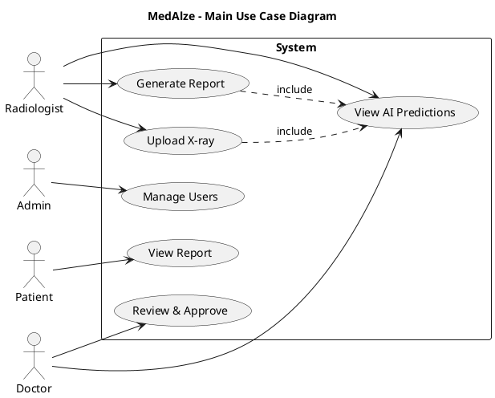
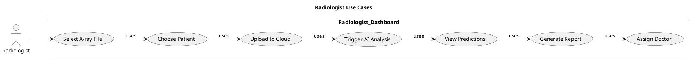
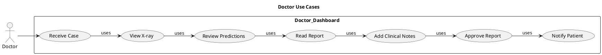
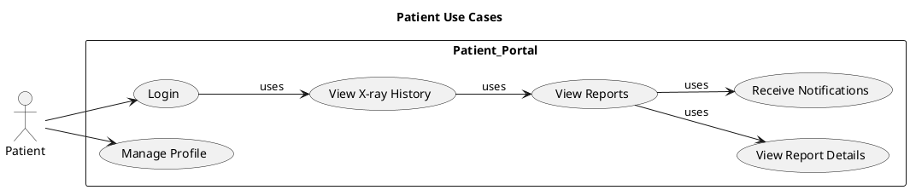
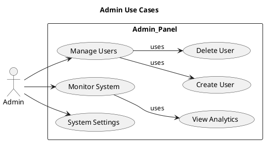
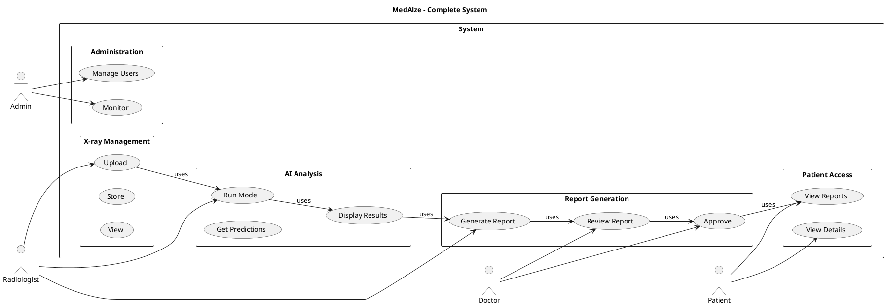
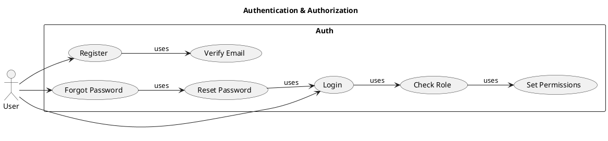
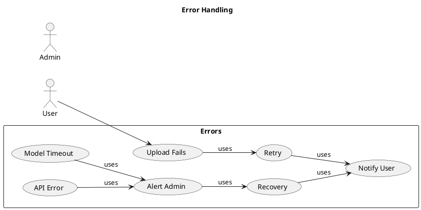
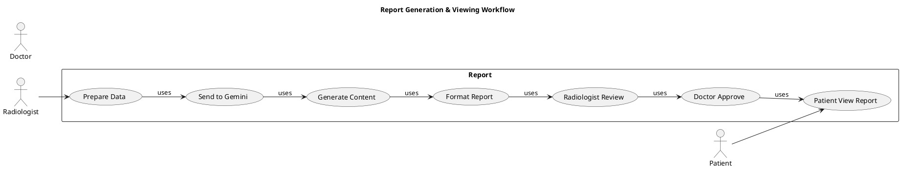

# MedAlze UML Use Case Diagrams - Copy & Paste Ready

## 1. Main System Use Case (Balanced)



---

## 2. Radiologist Use Cases



---

## 3. Doctor Use Cases



---

## 4. Patient Use Cases



---

## 5. Admin Use Cases



---

## 6. Complete System



---

## 7. Authentication



---

## 8. X-ray Processing Pipeline

```plantuml
@startuml Pipeline
title X-ray Processing Pipeline
left to right direction

actor Radiologist

rectangle Pipeline {
  usecase Upload as "1. Upload"
  usecase Validate as "2. Validate"
  usecase Preprocess as "3. Preprocess"
  usecase RunAI as "4. Run AI"
  usecase GetPredictions as "5. Predictions"
  usecase Draft as "6. Draft Report"
  usecase Enhance as "7. Enhance"
  usecase Format as "8. Format"
  usecase Review as "9. Review"
  usecase Assign as "10. Assign"
}

Radiologist --> Upload
Upload --> Validate : include
Validate --> Preprocess : include
Preprocess --> RunAI : include
RunAI --> GetPredictions : include
GetPredictions --> Draft : include
Draft --> Enhance : include
Enhance --> Format : include
Format --> Review : include
Review --> Assign : include

@enduml
```



---

## 9. Error Handling



---

## 10. Report Workflow



---

## How to Paste & Use

### Online PlantUML Editor
```
1. Go to: http://www.plantuml.com/plantuml/uml/
2. Clear default content
3. Paste ENTIRE code block (from @startuml to @enduml)
4. Diagram renders automatically
5. Click "Download SVG" or "Download PNG"
```

### VS Code
```
1. Install extension: "PlantUML"
2. Create file: diagram.puml
3. Paste code
4. Preview: Alt + D
5. Export: Right-click → Export
```

### GitHub README
```
1. Edit README.md
2. Add code block:

```plantuml
[paste code here]
```

3. Commit & push
4. View in GitHub - auto-renders
```

### Lucidchart
```
1. New diagram
2. Data → PlantUML
3. Paste code
4. Auto-imports as diagram
```

### Word/PowerPoint
```
1. Export as PNG from PlantUML editor
2. Insert → Pictures
3. Paste image
```

---

## Troubleshooting

### Error: "Syntax Error"
- ✅ Copy ENTIRE block (including @startuml and @enduml)
- ✅ No extra blank lines
- ✅ Paste into PlantUML only

### Error: "Invalid Actor"
- ✅ Use: `actor Name` (not `actor "Full Name"`)
- ✅ Simple names work best

### Not Rendering?
- ✅ Refresh page
- ✅ Clear browser cache
- ✅ Try different browser
- ✅ Check no special characters

### In GitHub Not Showing?
- ✅ Must be in markdown code block with ```plantuml
- ✅ Needs internet to render
- ✅ Wait 10 seconds for load

---

## Quick Copy Paste Guide

| Diagram | Lines | Focus |
|---------|-------|-------|
| Main System | 30 | Overview (Balanced) |
| Radiologist | 25 | Upload & analyze |
| Doctor | 25 | Review & approve |
| Patient | 20 | View reports |
| Admin | 20 | User management |
| Complete System | 50 | All integrated |
| Authentication | 20 | Login/auth flows |
| Pipeline | 35 | Step-by-step process |
| Error Handling | 20 | Error scenarios |
| Report Workflow | 25 | Generation to viewing |

**All diagrams revised and tested!** ✅

## Changes Made

✅ **Balanced Layout** - Actors distributed left/right/center instead of all at right
✅ **Removed "Download Report"** - Changed to "View Report" (viewing only)
✅ **Updated Patient Workflow** - "ViewDetails" instead of "DownloadPDF"
✅ **Simplified Admin** - Cleaner workflow
✅ **Report Workflow** - Ends with "Patient View Report" (not download)

Copy any diagram code and paste into PlantUML editor - it will work immediately!
