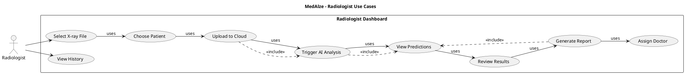
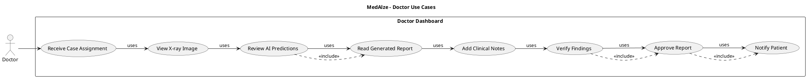
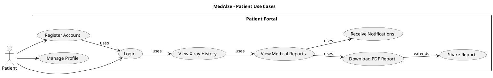
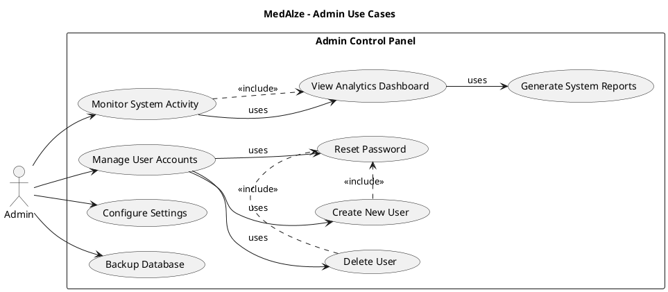
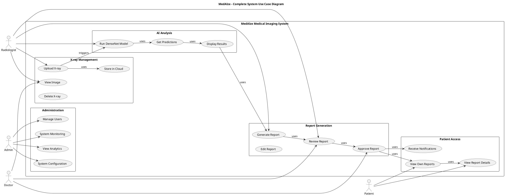
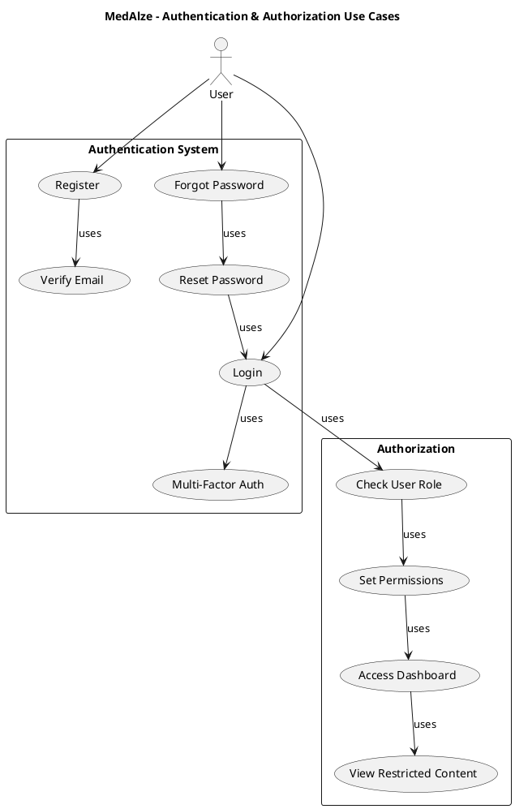
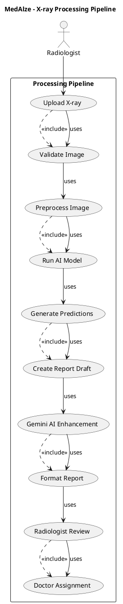
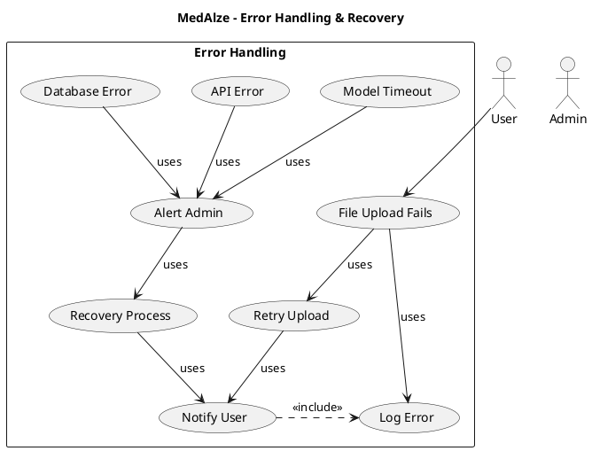

# MedAlze UML Use Case Diagrams

## 1. PlantUML - Main System Use Case Diagram

```plantuml
@startuml MedAlze_Main_UseCase
!define AWSPUML https://raw.githubusercontent.com/awslabs/aws-icons-for-plantuml/v14.0/dist
!include AWSPUML/AWSCommon.puml

title MedAlze - Main Use Case Diagram

left to right direction

actor Radiologist as R
actor Doctor as D
actor Patient as P
actor Admin as A

rectangle "MedAlze System" {
  usecase "Upload X-ray" as UC1
  usecase "View AI Predictions" as UC2
  usecase "Generate Medical Report" as UC3
  usecase "Assign to Doctor" as UC4
  usecase "Review & Approve" as UC5
  usecase "Download Report" as UC6
  usecase "Manage Users" as UC7
  usecase "View Analytics" as UC8
}

R --> UC1
R --> UC2
R --> UC3
R --> UC4
D --> UC5
D --> UC2
P --> UC6
A --> UC7
A --> UC8

UC1 .> UC2 : <<include>>
UC3 .> UC2 : <<include>>
UC5 .> UC2 : <<include>>

@enduml
```

---

## 2. PlantUML - Radiologist Detailed Use Cases



---

## 3. PlantUML - Doctor Approval Workflow



---

## 4. PlantUML - Patient Portal Use Cases



---

## 5. PlantUML - Admin Management Use Cases



---

## 6. PlantUML - Complete System with All Actors



---

## 7. PlantUML - Authentication & Authorization



---

## 8. PlantUML - X-ray Processing Pipeline



---

## 9. PlantUML - Error Handling & Recovery



---

## 10. XMI Format (For UML Tools)

```xml
<?xml version="1.0" encoding="UTF-8"?>
<uml:Model xmi:version="20131001" xmlns:xmi="http://www.omg.org/XMI" xmlns:xsi="http://www.w3.org/2001/XMLSchema-instance" xmlns:ecore="http://www.eclipse.org/emf/2002/Ecore" xmlns:uml="http://www.omg.org/uml/3.0.0/uml.ecore" xmi:id="_MedAlze_UseCaseModel" name="MedAlze Use Case Model">
  <ownedComment xmi:id="_comment1" annotatedElement="_MedAlze_UseCaseModel">
    <body>MedAlze Medical Imaging System - Use Case Diagram</body>
  </ownedComment>
  
  <packagedElement xmi:type="uml:UseCase" xmi:id="_UC_Upload" name="Upload X-ray">
    <ownedComment xmi:id="_UC_Upload_comment">
      <body>Radiologist uploads chest X-ray image to system</body>
    </ownedComment>
  </packagedElement>
  
  <packagedElement xmi:type="uml:UseCase" xmi:id="_UC_Analyze" name="Analyze with AI">
    <ownedComment xmi:id="_UC_Analyze_comment">
      <body>DenseNet-121 model analyzes X-ray and generates predictions</body>
    </ownedComment>
  </packagedElement>
  
  <packagedElement xmi:type="uml:UseCase" xmi:id="_UC_GenReport" name="Generate Report">
    <ownedComment xmi:id="_UC_GenReport_comment">
      <body>Gemini AI generates medical report based on predictions</body>
    </ownedComment>
  </packagedElement>
  
  <packagedElement xmi:type="uml:UseCase" xmi:id="_UC_Review" name="Review & Approve">
    <ownedComment xmi:id="_UC_Review_comment">
      <body>Doctor reviews and approves the medical report</body>
    </ownedComment>
  </packagedElement>
  
  <packagedElement xmi:type="uml:UseCase" xmi:id="_UC_Download" name="Download Report">
    <ownedComment xmi:id="_UC_Download_comment">
      <body>Patient downloads report as PDF</body>
    </ownedComment>
  </packagedElement>
  
  <packagedElement xmi:type="uml:Actor" xmi:id="_A_Radiologist" name="Radiologist"/>
  <packagedElement xmi:type="uml:Actor" xmi:id="_A_Doctor" name="Doctor"/>
  <packagedElement xmi:type="uml:Actor" xmi:id="_A_Patient" name="Patient"/>
  <packagedElement xmi:type="uml:Actor" xmi:id="_A_Admin" name="Admin"/>
  
  <packagedElement xmi:type="uml:Association" xmi:id="_Assoc_R_Upload">
    <memberEnd xmi:id="_Assoc_R_Upload_end1" name="" type="_A_Radiologist"/>
    <memberEnd xmi:id="_Assoc_R_Upload_end2" name="" type="_UC_Upload"/>
  </packagedElement>
  
  <packagedElement xmi:type="uml:Association" xmi:id="_Assoc_Upload_Analyze">
    <memberEnd xmi:id="_Assoc_Upload_Analyze_end1" name="" type="_UC_Upload"/>
    <memberEnd xmi:id="_Assoc_Upload_Analyze_end2" name="" type="_UC_Analyze"/>
  </packagedElement>
  
  <packagedElement xmi:type="uml:Association" xmi:id="_Assoc_Analyze_GenReport">
    <memberEnd xmi:id="_Assoc_Analyze_GenReport_end1" name="" type="_UC_Analyze"/>
    <memberEnd xmi:id="_Assoc_Analyze_GenReport_end2" name="" type="_UC_GenReport"/>
  </packagedElement>
  
  <packagedElement xmi:type="uml:Association" xmi:id="_Assoc_D_Review">
    <memberEnd xmi:id="_Assoc_D_Review_end1" name="" type="_A_Doctor"/>
    <memberEnd xmi:id="_Assoc_D_Review_end2" name="" type="_UC_Review"/>
  </packagedElement>
  
  <packagedElement xmi:type="uml:Association" xmi:id="_Assoc_P_Download">
    <memberEnd xmi:id="_Assoc_P_Download_end1" name="" type="_A_Patient"/>
    <memberEnd xmi:id="_Assoc_P_Download_end2" name="" type="_UC_Download"/>
  </packagedElement>
</uml:Model>
```

---

## How to Use These UML Codes

### PlantUML (Recommended)
**Tools:** Lucidchart, Visual Paradigm, PlantUML Online
```
1. Go to www.plantuml.com/plantuml/uml/
2. Paste the PlantUML code
3. Auto-renders as UML diagram
4. Export as PNG/SVG
```

### In VS Code
```
1. Install PlantUML extension
2. Create .puml file
3. Paste code
4. Preview with Alt+D
```

### In GitHub
```
1. Create PLANTUML_USECASE.md
2. Add code blocks with ```plantuml
3. GitHub auto-renders
```

### StarUML / Enterprise Architect
```
1. Import XMI file
2. Or manually recreate from diagram
3. Export to various formats
```

### ArchiMate / TOGAF
```
1. Use PlantUML code as reference
2. Map to ArchiMate notation
3. Import into Enterprise Architect
```

---

## Key Relationships in UML Notation

| Notation | Meaning |
|----------|---------|
| `-->` | Association (actor uses use case) |
| `.>` | Dependency (with stereotype) |
| `<<include>>` | Mandatory inclusion |
| `<<extend>>` | Optional extension |
| `<<uses>>` | General association |

---

## Export Options

All PlantUML diagrams can be exported to:
- ✅ PNG (high quality)
- ✅ SVG (scalable vector)
- ✅ PDF (for documents)
- ✅ EPS (for printing)
- ✅ ASCII (for plain text)

**File Naming Convention:**
```
MedAlze_[ComponentName]_UseCase.[format]
- MedAlze_Main_UseCase.png
- MedAlze_Radiologist_UseCase.svg
- MedAlze_Complete_System.pdf
```

---

**Total UML Diagrams:** 10 comprehensive use case diagrams ✅
