# MedAlze Professional Use Case Diagrams

## 1. Main System Use Case Diagram

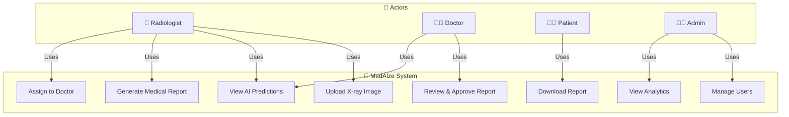

---

## 2. Radiologist Workflow Use Cases

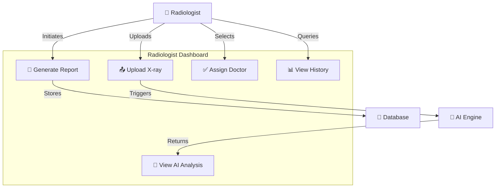

---

## 3. Doctor Review Workflow

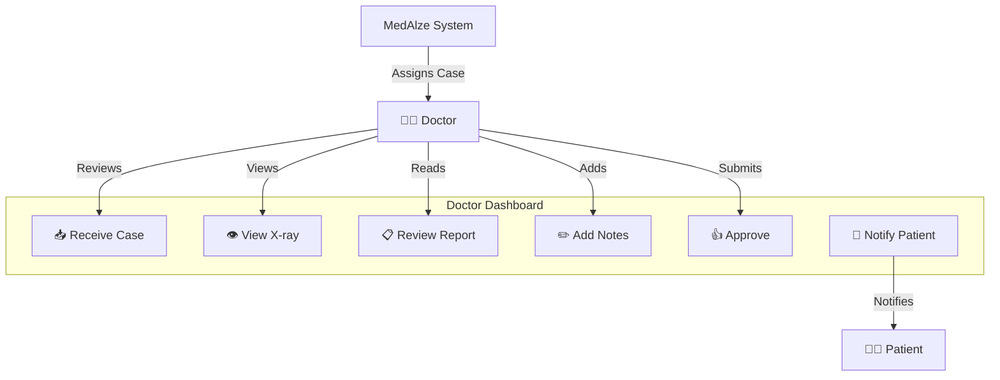

---

## 4. Patient Portal Use Cases

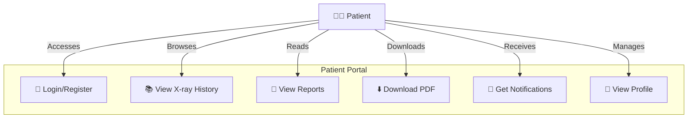

---

## 5. Admin Management Use Cases

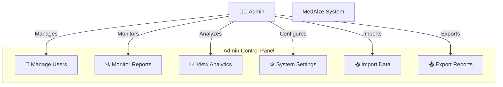

---

## 6. Complete System Architecture with Use Cases

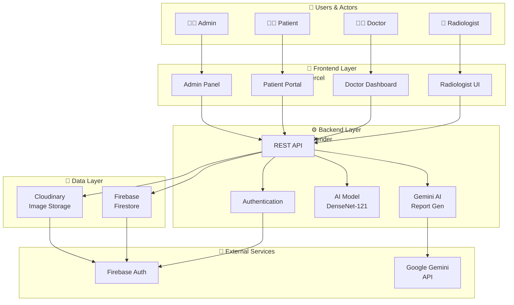

---

## 7. X-ray Processing Pipeline (Use Case Flow)

```mermaid
graph LR
    A["📤 Upload X-ray<br/>Radiologist"] 
    --> B["☁️ Store in Cloud<br/>Cloudinary"]
    --> C["🔄 Preprocess<br/>Image Prep"]
    --> D["🤖 Run AI Model<br/>DenseNet-121"]
    --> E["📊 Get Predictions<br/>14 Conditions"]
    --> F["🧠 Generate Report<br/>Gemini AI"]
    --> G["✏️ Review Report<br/>Radiologist"]
    --> H["✅ Assign Doctor<br/>Doctor Queue"]
    --> I["👁️ Doctor Reviews<br/>Doctor Dashboard"]
    --> J["✍️ Approve/Comment<br/>Doctor"]
    --> K["🔔 Notify Patient<br/>Notifications"]
    --> L["📥 Patient Access<br/>Patient Portal"]
    --> M["⬇️ Download PDF<br/>Patient"]
```

---

## 8. Use Case: Upload & Analyze X-ray

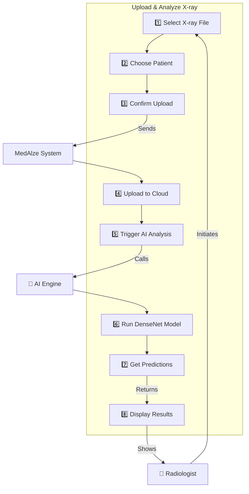

---

## 9. Use Case: Generate Medical Report

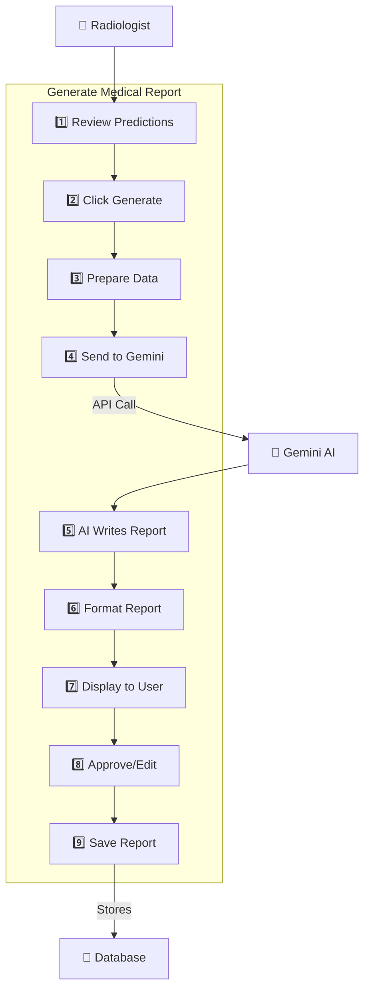

---

## 10. Use Case: Doctor Approval Workflow

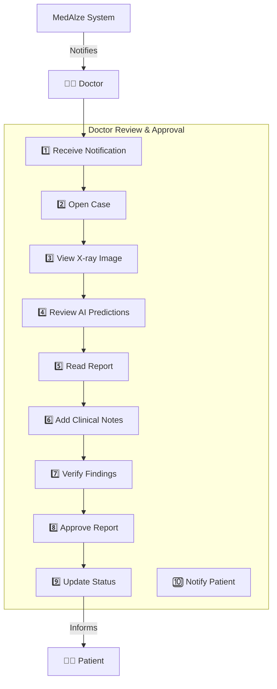

---

## 11. Authentication & Authorization Use Cases

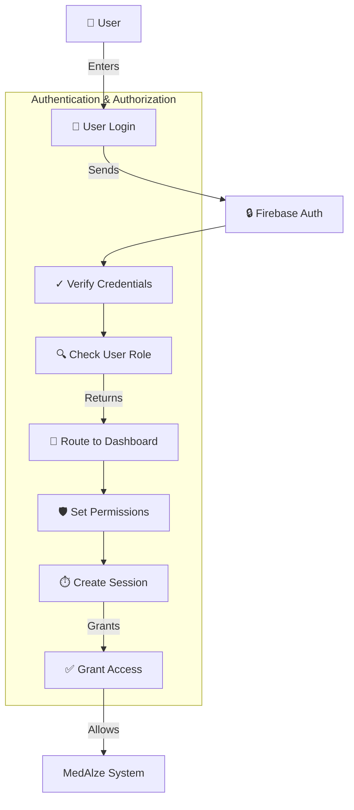

---

## 12. Patient Download & Access Use Cases

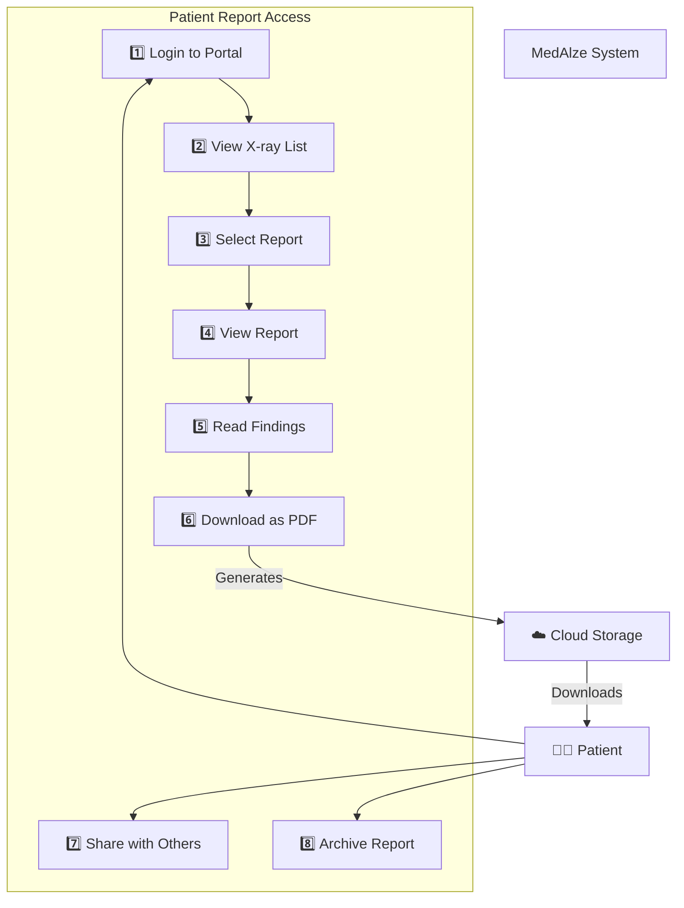

---

## 13. Admin Monitoring & Analytics Use Cases

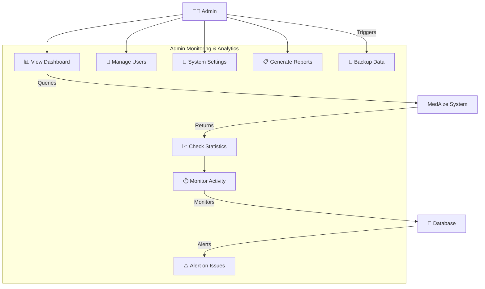

---

## 14. Error Handling & Recovery Use Cases

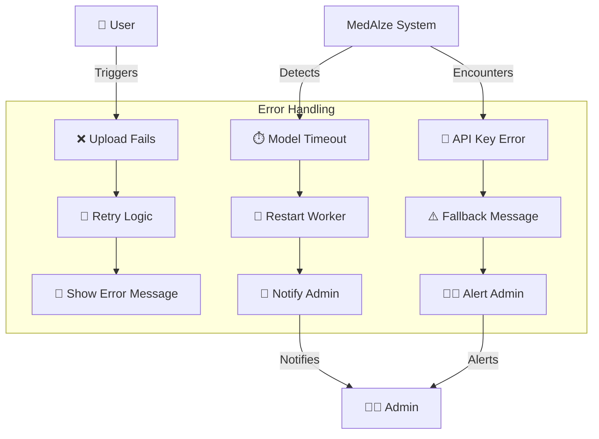

---

## 15. System Integration Use Cases

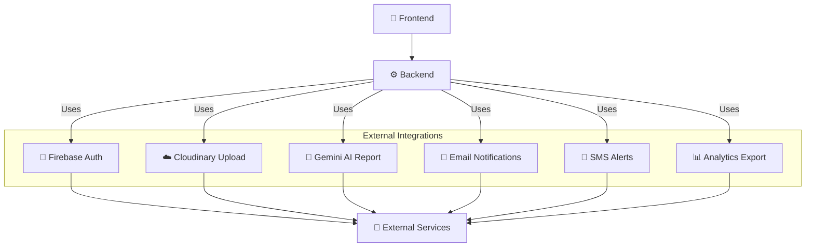

---

## How to Use These Diagrams

### In GitHub (README.md)
```markdown
## System Architecture

[View Use Case Diagram](#main-system-use-case-diagram)


```

### In Draw.io
1. Copy the Mermaid code
2. Go to draw.io
3. Click "File" → "Import from" → "Mermaid"
4. Paste the code
5. Auto-renders as diagram

### In Notion
1. Create code block
2. Select language: "mermaid"
3. Paste diagram code
4. Renders automatically

### In Microsoft Teams/Slack
1. Copy as image
2. Paste into chat
3. Or embed as documentation

---

## Color Legend

| Symbol | Meaning |
|--------|---------|
| 🔬 | Radiologist (Medical professional analyzing X-rays) |
| 👨‍⚕️ | Doctor (Clinical review & approval) |
| 🧑‍⚕️ | Patient (End user) |
| 👨‍💼 | Admin (System management) |
| 🤖 | AI/ML System (Automated processing) |
| ☁️ | Cloud Services (External storage/APIs) |
| 🔐 | Security/Authentication |
| 💾 | Database/Storage |
| 🔔 | Notifications |

---

**Total Diagrams:** 15 comprehensive use case flows covering all system aspects ✅
